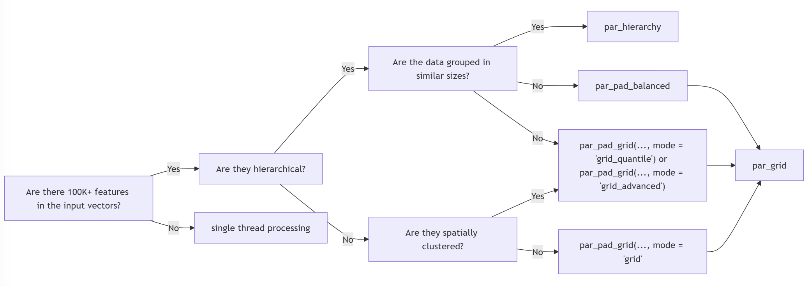

# Computation of Spatial Data by Hierarchical and Objective Partitioning of Inputs for Parallel Processing <a href="https://docs.ropensci.org/chopin/"></a>

<!-- badges: start -->
<!-- [](https://github.com/ropensci/chopin/actions) -->


[](https://github.com/ropensci/chopin/actions/workflows/check-standard.yaml)
[](https://github.com/ropensci/software-review/issues/638)
[](https://ropensci.r-universe.dev/chopin)
[](https://cran.r-project.org/package=chopin)
[](https://cran.r-project.org/package=chopin)
[](https://docs.ropensci.org/chopin/)
[](https://lifecycle.r-lib.org/articles/stages.html#stable)
<!-- badges: end -->

## Objective

This package automates
[parallelization](https://en.wikipedia.org/wiki/Parallel_computing) in
spatial operations with `chopin` functions as well as
[sf](https://github.com/r-spatial/sf)/[terra](https://github.com/rspatial/terra)
functions. With [GDAL](https://gdal.org)-compatible files and database
tables, `chopin` functions help to calculate spatial variables from
vector and raster data with no external software requirements. All who
need to perform geospatial operations with large datasets may find this
package useful to accelerate the covariate calculation process for
further analysis and modeling may find the main functions useful. We
assume that users have basic knowledge of [geographic information system
data models](https://r.geocompx.org/spatial-class), [coordinate systems
and transformations](https://doi.org/10.22224/gistbok/2023.1.2),
[spatial operations](https://r.geocompx.org/spatial-operations), and
[raster-vector overlay](https://r.geocompx.org/raster-vector).

## Overview

`chopin` encapsulates the parallel processing of spatial computation
into three steps. **First,** users will define the parallelization
strategy, which is one of many supported in `future` and `future.mirai`
packages. Users always need to register parallel workers with `future`
before running the `par_*()` functions that will be introduced below.

``` r
future::plan(future.mirai::mirai_multisession, workers = 4L)
# future::multisession, future::cluster are available,
# See future.batchtools and future.callr for other options
# the number of workers are up to users' choice
```

**Second,** users choose the proper data parallelization configuration
by creating a grid partition of the processing extent, defining the
field name with values that are hierarchically coded, or entering
multiple raster file paths into `par_multirasters()`. **Finally,** users
run `par_*()` function with the configurations set above to compute
spatial variables from input data in parallel:

- `par_grid`: parallelize over artificial grid polygons that are
  generated from the maximum extent of inputs. `par_pad_grid` is used to
  generate the grid polygons before running this function.

- `par_hierarchy`: parallelize over hierarchy coded in identifier fields
  (for example, census blocks in each county in the US)

- `par_multirasters`: parallelize over multiple raster files

- Each of the `par_*` functions introduced above has `mirai` version
  with a suffix `_mirai` after the function names: `par_grid_mirai`,
  `par_hierarchy_mirai`, and `par_multirasters`. These functions will
  work properly after creating daemons with `mirai::daemons`.

``` r
mirai::daemons(4L)
```

For grid partitioning, the entire study area will be divided into partly
overlapped grids. We suggest two flowcharts to help which function to
use for parallel processing below. The upper flowchart is
raster-oriented and the lower is vector-oriented. They are supplementary
to each other. When a user follows the raster-oriented one, they might
visit the vector-oriented flowchart at each end of the raster-oriented
flowchart.

Processing functions accept
[terra](https://github.com/rspatial/terra)/[sf](https://github.com/r-spatial/sf)
classes for spatial data. Raster-vector overlay is done with
`exactextractr`. Three helper functions encapsulate multiple geospatial
data calculation steps over multiple CPU threads.

- `extract_at`: extract raster values with point buffers or polygons
  with or without kernel weights

- `summarize_sedc`: calculate sums of exponentially decaying
  contributions

- `summarize_aw`: area-weighted covariates based on target and reference
  polygons

### Function selection guide

We provide two flowcharts to help users choose the right function for
parallel processing. The raster-oriented flowchart is for users who want
to start with raster data, and the vector-oriented flowchart is for
users with large vector data.

In **raster-oriented selection**, we suggest four factors to consider:

- Number of raster files: for multiple files, `par_multirasters` is
  recommended. When there are multiple rasters that share the same
  extent and resolution, consider stacking the rasters into multilayer
  SpatRaster object by calling `terra::rast(filenames)`.
- Raster resolution: We suggest 100 meters as a threshold. Rasters with
  resolution coarser than 100 meters and a few layers would be better
  for the direct call of `exactextractr::exact_extract()`.
- Raster extent: Using `SpatRaster` in `exactextractr::exact_extract()`
  is often minimally affected by the raster extent.
- Memory size: `max_cells_in_memory` argument value of
  `exactextractr::exact_extract()`, raster resolution, and the number of
  layers in `SpatRaster` are multiplicatively related to the memory
  usage.


For **vector-oriented selection**, we suggest three factors to consider:

- Number of features: When the number of features is over 100,000,
  consider using `par_grid` or `par_hierarchy` to split the data into
  smaller chunks.
- Hierarchical structure: If the data has a hierarchical structure,
  consider using `par_hierarchy` to parallelize the operation.
- Data grouping: If the data needs to be grouped in similar sizes,
  consider using `par_pad_balanced` or `par_pad_grid` with
  `mode = "grid_quantile"`.



## Installation

From version 0.9.4, `chopin` is available on CRAN.

``` r
install.packages("chopin")
```

`chopin` can be installed using `remotes::install_github` (also possible
with `pak::pak` or `devtools::install_github`).

``` r
rlang::check_installed("remotes")
remotes::install_github("ropensci/chopin")
```

or you can also set `repos` in `install.packages()` as ROpenSci
repository:

``` r
# More recent version is available rOpenSci universe
install.packages("chopin", repos = "https://ropensci.r-universe.dev")
```

## Examples

Examples will navigate `par_grid`, `par_hierarchy`, and
`par_multirasters` functions in `chopin` to parallelize geospatial
operations.

``` r
# check and install packages to run examples
pkgs <- c("chopin", "dplyr", "sf", "terra", "future", "future.mirai", "mirai")
# install packages if anything is unavailable
rlang::check_installed(pkgs)

library(chopin)
library(dplyr)
#> 
#> Attaching package: 'dplyr'
#> The following objects are masked from 'package:stats':
#> 
#>     filter, lag
#> The following objects are masked from 'package:base':
#> 
#>     intersect, setdiff, setequal, union
library(sf)
#> Linking to GEOS 3.12.1, GDAL 3.8.4, PROJ 9.4.0; sf_use_s2() is TRUE
library(terra)
#> terra 1.8.54
library(future)
library(future.mirai)
library(mirai)

# disable spherical geometries
sf::sf_use_s2(FALSE)
#> Spherical geometry (s2) switched off

# parallelization-safe random number generator
set.seed(2024, kind = "L'Ecuyer-CMRG")
```

### `par_grid`: parallelize over artificial grid polygons

Please refer to a small example below for extracting mean altitude
values at circular point buffers and census tracts in North Carolina.
Before running code chunks below, set the cloned `chopin` repository as
your working directory with `setwd()`

``` r
ncpoly <- system.file("shape/nc.shp", package = "sf")
ncsf <- sf::read_sf(ncpoly)
ncsf <- sf::st_transform(ncsf, "EPSG:5070")
plot(sf::st_geometry(ncsf))
```


#### Generate random points in NC

Ten thousands random point locations were generated inside the counties
of North Carolina.

``` r
ncpoints <- sf::st_sample(ncsf, 1e4)
ncpoints <- sf::st_as_sf(ncpoints)
ncpoints$pid <- sprintf("PID-%05d", seq(1, 1e4))
plot(sf::st_geometry(ncpoints))
```


#### Target raster dataset: [Shuttle Radar Topography Mission](https://www.usgs.gov/centers/eros/science/usgs-eros-archive-digital-elevation-shuttle-radar-topography-mission-srtm-1)

We use an elevation dataset with and a moderate spatial resolution
(approximately 400 meters or 0.25 miles).

``` r
# data preparation
srtm_path <- file.path(tempdir(check = TRUE), "nc_srtm15_otm.tif")
srtm_url <-
  paste0(
    "https://raw.githubusercontent.com/",
    "ropensci/chopin/refs/heads/main/",
    "tests/testdata/nc_srtm15_otm.tif"
  )
download.file(srtm_url, srtm_path, mode = "wb")

# terra SpatRaster objects are wrapped when exported to rds file
srtm_ras <- terra::rast(srtm_path)
terra::crs(srtm_ras) <- "EPSG:5070"
srtm_ras
#> class       : SpatRaster 
#> size        : 1534, 2281, 1  (nrow, ncol, nlyr)
#> resolution  : 391.5026, 391.5026  (x, y)
#> extent      : 1012872, 1905890, 1219961, 1820526  (xmin, xmax, ymin, ymax)
#> coord. ref. : NAD83 / Conus Albers (EPSG:5070) 
#> source      : nc_srtm15_otm.tif 
#> name        :    srtm15 
#> min value   : -3589.291 
#> max value   :  1946.400
terra::plot(srtm_ras)
```


``` r
# ncpoints_tr <- terra::vect(ncpoints)
system.time(
  ncpoints_srtm <-
    chopin::extract_at(
      x = srtm_ras,
      y = ncpoints,
      id = "pid",
      mode = "buffer",
      radius = 1e4L  # 10,000 meters (10 km)
    )
)
#>    user  system elapsed 
#>   5.384   0.089   5.474
```

#### Generate regular grid computational regions

`chopin::par_pad_grid()` takes a spatial dataset to generate regular
grid polygons with `nx` and `ny` arguments with padding. Users will have
both overlapping (by the degree of `radius`) and non-overlapping grids,
both of which will be utilized to split locations and target datasets
into sub-datasets for efficient processing.

``` r
compregions <-
  chopin::par_pad_grid(
    ncpoints,
    mode = "grid",
    nx = 2L,
    ny = 2L,
    padding = 1e4L
  )
#> Switch sf class to terra...
#> Switch terra class to sf...
```

`compregions` is a list object with two elements named `original`
(non-overlapping grid polygons) and `padded` (overlapping by `padding`).
The figures below illustrate the grid polygons with and without
overlaps.

``` r
names(compregions)
#> [1] "original" "padded"

oldpar <- par()
par(mfrow = c(2, 1))
terra::plot(
  terra::vect(compregions$original),
  main = "Original grids"
)
terra::plot(
  terra::vect(compregions$padded),
  main = "Padded grids"
)
```


#### Parallel processing

Using the grid polygons, we distribute the task of averaging elevations
at 10,000 circular buffer polygons, which are generated from the random
locations, with 10 kilometers radius by `chopin::par_grid()`. Users
always need to **register** multiple CPU threads (logical cores) for
parallelization. `chopin::par_*()` functions are flexible in terms of
supporting generic spatial operations in `sf` and `terra`, especially
where two datasets are involved. Users can inject generic functions’
arguments (parameters) by writing them in the ellipsis (`...`)
arguments, as demonstrated below:

``` r
future::plan(future.mirai::mirai_multisession, workers = 4L)

system.time(
  ncpoints_srtm_mthr <-
    par_grid(
      grids = compregions,
      fun_dist = extract_at,
      x = srtm_ras,
      y = ncpoints,
      id = "pid",
      radius = 1e4L,
      .standalone = FALSE
    )
)
#> ℹ SpatRaster class input is detected.
#> Attempt to track the data source file path...
#> ℹ Input is not a character.
#> Input is a character. Attempt to read it with terra::rast...
#> ℹ Task at CGRIDID: 1 is successfully dispatched.
#> 
#> Input is a character. Attempt to read it with terra::rast...
#> ℹ Task at CGRIDID: 2 is successfully dispatched.
#> 
#> Input is a character. Attempt to read it with terra::rast...
#> ℹ Task at CGRIDID: 3 is successfully dispatched.
#> 
#> Input is a character. Attempt to read it with terra::rast...
#> ℹ Task at CGRIDID: 4 is successfully dispatched.
#>    user  system elapsed 
#>   1.927   0.207  11.209

ncpoints_srtm <-
  extract_at(
    x = srtm_ras,
    y = ncpoints,
    id = "pid",
    radius = 1e4L
  )

future::plan(future::sequential)
mirai::daemons(0L)
#> [1] 0
```

``` r
colnames(ncpoints_srtm_mthr)[2] <- "mean_par"
ncpoints_compar <- merge(ncpoints_srtm, ncpoints_srtm_mthr)
# Are the calculations equal?
all.equal(ncpoints_compar$mean, ncpoints_compar$mean_par)
#> [1] TRUE
```

``` r
ncpoints_s <-
  merge(ncpoints, ncpoints_srtm)
ncpoints_m <-
  merge(ncpoints, ncpoints_srtm_mthr)

plot(ncpoints_s[, "mean"], main = "Single-thread", pch = 19, cex = 0.33)
```


``` r
plot(ncpoints_m[, "mean_par"], main = "Multi-thread", pch = 19, cex = 0.33)
```


The same workflow operates on `mirai` dispatchers.

``` r
mirai::daemons(4L)
#> [1] 4

system.time(
  ncpoints_srtm_mthr <-
    par_grid_mirai(
      grids = compregions,
      fun_dist = extract_at,
      x = srtm_ras,
      y = ncpoints,
      id = "pid",
      radius = 1e4L,
      .standalone = FALSE
    )
)
#> ℹ SpatRaster class input is detected.
#> Attempt to track the data source file path...
#> ℹ Input is not a character.
#> ■■■■■■■■■                         25% | ETA: 25s
#> ■■■■■■■■■■■■■■■■■■■■■■■■■■■■■■■  100% | ETA:  0s
#>    user  system elapsed 
#>   0.955   0.192  10.081

# remove mirai::daemons
mirai::daemons(0L)
#> [1] 0
```

### `chopin::par_hierarchy()`: parallelize geospatial computations using intrinsic data hierarchy

We usually have nested/exhaustive hierarchies in real-world datasets.
For example, land is organized by administrative/jurisdictional borders
where multiple levels exist. In the U.S. context, a state consists of
several counties, counties are split into census tracts, and they have a
group of block groups. `chopin::par_hierarchy()` leverages such
hierarchies to parallelize geospatial operations, which means that a
group of lower-level geographic units in a higher-level geography is
assigned to a process. A demonstration below shows that census tracts
are grouped by their counties then each county will be processed in a
CPU thread.

#### Read data

``` r
# nc_hierarchy.gpkg includes two layers: county and tracts
hierarchy_path <- file.path(tempdir(check = TRUE), "nc_hierarchy.gpkg")
hierarchy_url <-
  paste0(
    "https://raw.githubusercontent.com/",
    "ropensci/chopin/refs/heads/main/",
    "tests/testdata/nc_hierarchy.gpkg"
  )
download.file(hierarchy_url, hierarchy_path, mode = "wb")

nc_data <- hierarchy_path
nc_county <- sf::st_read(nc_data, layer = "county")
#> Reading layer `county' from data source `/tmp/Rtmph96u0D/nc_hierarchy.gpkg' using driver `GPKG'
#> Simple feature collection with 100 features and 1 field
#> Geometry type: POLYGON
#> Dimension:     XY
#> Bounding box:  xmin: 1054155 ymin: 1341756 xmax: 1838923 ymax: 1690176
#> Projected CRS: NAD83 / Conus Albers
nc_tracts <- sf::st_read(nc_data, layer = "tracts")
#> Reading layer `tracts' from data source `/tmp/Rtmph96u0D/nc_hierarchy.gpkg' using driver `GPKG'
#> Simple feature collection with 2672 features and 1 field
#> Geometry type: MULTIPOLYGON
#> Dimension:     XY
#> Bounding box:  xmin: 1054155 ymin: 1341756 xmax: 1838923 ymax: 1690176
#> Projected CRS: NAD83 / Conus Albers

# reproject to Conus Albers Equal Area
nc_county <- sf::st_transform(nc_county, "EPSG:5070")
nc_tracts <- sf::st_transform(nc_tracts, "EPSG:5070")
nc_tracts$COUNTY <- substr(nc_tracts$GEOID, 1, 5)
```

#### Extract average SRTM elevations by single and multiple threads

``` r
future::plan(future.mirai::mirai_multisession, workers = 4L)

# single-thread
system.time(
  nc_elev_tr_single <-
    chopin::extract_at(
      x = srtm_ras,
      y = nc_tracts,
      id = "GEOID"
    )
)
#>    user  system elapsed 
#>   0.537   0.002   0.539

# hierarchical parallelization
system.time(
  nc_elev_tr_distr <-
    chopin::par_hierarchy(
      regions = nc_county, # higher level geometry
      regions_id = "GEOID", # higher level unique id
      fun_dist = extract_at,
      x = srtm_ras,
      y = nc_tracts, # lower level geometry
      id = "GEOID", # lower level unique id
      func = "mean"
    )
)
#> ℹ SpatRaster class input is detected.
#> Attempt to track the data source file path...
#> ℹ Input is not a character.
#> ℹ GEOID is used to stratify the process.
#> Input is a character. Attempt to read it with terra::rast...
#> ℹ Your input function at 37037 is dispatched.
#> 
#> Input is a character. Attempt to read it with terra::rast...
#> ℹ Your input function at 37001 is dispatched.
#> 
#> Input is a character. Attempt to read it with terra::rast...
#> ℹ Your input function at 37057 is dispatched.
#> 
#> Input is a character. Attempt to read it with terra::rast...
#> ℹ Your input function at 37069 is dispatched.
#> 
#> Input is a character. Attempt to read it with terra::rast...
#> ℹ Your input function at 37155 is dispatched.
#> 
#> Input is a character. Attempt to read it with terra::rast...
#> ℹ Your input function at 37109 is dispatched.
#> 
#> Input is a character. Attempt to read it with terra::rast...
#> ℹ Your input function at 37027 is dispatched.
#> 
#> Input is a character. Attempt to read it with terra::rast...
#> ℹ Your input function at 37063 is dispatched.
#> 
#> Input is a character. Attempt to read it with terra::rast...
#> ℹ Your input function at 37145 is dispatched.
#> 
#> Input is a character. Attempt to read it with terra::rast...
#> ℹ Your input function at 37115 is dispatched.
#> 
#> Input is a character. Attempt to read it with terra::rast...
#> ℹ Your input function at 37151 is dispatched.
#> 
#> Input is a character. Attempt to read it with terra::rast...
#> ℹ Your input function at 37131 is dispatched.
#> 
#> Input is a character. Attempt to read it with terra::rast...
#> ℹ Your input function at 37013 is dispatched.
#> 
#> Input is a character. Attempt to read it with terra::rast...
#> ℹ Your input function at 37159 is dispatched.
#> 
#> Input is a character. Attempt to read it with terra::rast...
#> ℹ Your input function at 37051 is dispatched.
#> 
#> Input is a character. Attempt to read it with terra::rast...
#> ℹ Your input function at 37153 is dispatched.
#> 
#> Input is a character. Attempt to read it with terra::rast...
#> ℹ Your input function at 37093 is dispatched.
#> 
#> Input is a character. Attempt to read it with terra::rast...
#> ℹ Your input function at 37025 is dispatched.
#> 
#> Input is a character. Attempt to read it with terra::rast...
#> ℹ Your input function at 37029 is dispatched.
#> 
#> Input is a character. Attempt to read it with terra::rast...
#> ℹ Your input function at 37169 is dispatched.
#> 
#> Input is a character. Attempt to read it with terra::rast...
#> ℹ Your input function at 37031 is dispatched.
#> 
#> Input is a character. Attempt to read it with terra::rast...
#> ℹ Your input function at 37005 is dispatched.
#> 
#> Input is a character. Attempt to read it with terra::rast...
#> ℹ Your input function at 37139 is dispatched.
#> 
#> Input is a character. Attempt to read it with terra::rast...
#> ℹ Your input function at 37193 is dispatched.
#> 
#> Input is a character. Attempt to read it with terra::rast...
#> ℹ Your input function at 37003 is dispatched.
#> 
#> Input is a character. Attempt to read it with terra::rast...
#> ℹ Your input function at 37083 is dispatched.
#> 
#> Input is a character. Attempt to read it with terra::rast...
#> ℹ Your input function at 37163 is dispatched.
#> 
#> Input is a character. Attempt to read it with terra::rast...
#> ℹ Your input function at 37189 is dispatched.
#> 
#> Input is a character. Attempt to read it with terra::rast...
#> ℹ Your input function at 37173 is dispatched.
#> 
#> Input is a character. Attempt to read it with terra::rast...
#> ℹ Your input function at 37011 is dispatched.
#> 
#> Input is a character. Attempt to read it with terra::rast...
#> ℹ Your input function at 37045 is dispatched.
#> 
#> Input is a character. Attempt to read it with terra::rast...
#> ℹ Your input function at 37125 is dispatched.
#> 
#> Input is a character. Attempt to read it with terra::rast...
#> ℹ Your input function at 37067 is dispatched.
#> 
#> Input is a character. Attempt to read it with terra::rast...
#> ℹ Your input function at 37077 is dispatched.
#> 
#> Input is a character. Attempt to read it with terra::rast...
#> ℹ Your input function at 37185 is dispatched.
#> 
#> Input is a character. Attempt to read it with terra::rast...
#> ℹ Your input function at 37137 is dispatched.
#> 
#> Input is a character. Attempt to read it with terra::rast...
#> ℹ Your input function at 37033 is dispatched.
#> 
#> Input is a character. Attempt to read it with terra::rast...
#> ℹ Your input function at 37107 is dispatched.
#> 
#> Input is a character. Attempt to read it with terra::rast...
#> ℹ Your input function at 37075 is dispatched.
#> 
#> Input is a character. Attempt to read it with terra::rast...
#> ℹ Your input function at 37073 is dispatched.
#> 
#> Input is a character. Attempt to read it with terra::rast...
#> ℹ Your input function at 37161 is dispatched.
#> 
#> Input is a character. Attempt to read it with terra::rast...
#> ℹ Your input function at 37187 is dispatched.
#> 
#> Input is a character. Attempt to read it with terra::rast...
#> ℹ Your input function at 37007 is dispatched.
#> 
#> Input is a character. Attempt to read it with terra::rast...
#> ℹ Your input function at 37135 is dispatched.
#> 
#> Input is a character. Attempt to read it with terra::rast...
#> ℹ Your input function at 37049 is dispatched.
#> 
#> Input is a character. Attempt to read it with terra::rast...
#> ℹ Your input function at 37195 is dispatched.
#> 
#> Input is a character. Attempt to read it with terra::rast...
#> ℹ Your input function at 37061 is dispatched.
#> 
#> Input is a character. Attempt to read it with terra::rast...
#> ℹ Your input function at 37087 is dispatched.
#> 
#> Input is a character. Attempt to read it with terra::rast...
#> ℹ Your input function at 37081 is dispatched.
#> 
#> Input is a character. Attempt to read it with terra::rast...
#> ℹ Your input function at 37099 is dispatched.
#> 
#> Input is a character. Attempt to read it with terra::rast...
#> ℹ Your input function at 37097 is dispatched.
#> 
#> Input is a character. Attempt to read it with terra::rast...
#> ℹ Your input function at 37091 is dispatched.
#> 
#> Input is a character. Attempt to read it with terra::rast...
#> ℹ Your input function at 37149 is dispatched.
#> 
#> Input is a character. Attempt to read it with terra::rast...
#> ℹ Your input function at 37165 is dispatched.
#> 
#> Input is a character. Attempt to read it with terra::rast...
#> ℹ Your input function at 37085 is dispatched.
#> 
#> Input is a character. Attempt to read it with terra::rast...
#> ℹ Your input function at 37105 is dispatched.
#> 
#> Input is a character. Attempt to read it with terra::rast...
#> ℹ Your input function at 37017 is dispatched.
#> 
#> Input is a character. Attempt to read it with terra::rast...
#> ℹ Your input function at 37039 is dispatched.
#> 
#> Input is a character. Attempt to read it with terra::rast...
#> ℹ Your input function at 37035 is dispatched.
#> 
#> Input is a character. Attempt to read it with terra::rast...
#> ℹ Your input function at 37177 is dispatched.
#> 
#> Input is a character. Attempt to read it with terra::rast...
#> ℹ Your input function at 37113 is dispatched.
#> 
#> Input is a character. Attempt to read it with terra::rast...
#> ℹ Your input function at 37143 is dispatched.
#> 
#> Input is a character. Attempt to read it with terra::rast...
#> ℹ Your input function at 37095 is dispatched.
#> 
#> Input is a character. Attempt to read it with terra::rast...
#> ℹ Your input function at 37071 is dispatched.
#> 
#> Input is a character. Attempt to read it with terra::rast...
#> ℹ Your input function at 37101 is dispatched.
#> 
#> Input is a character. Attempt to read it with terra::rast...
#> ℹ Your input function at 37015 is dispatched.
#> 
#> Input is a character. Attempt to read it with terra::rast...
#> ℹ Your input function at 37167 is dispatched.
#> 
#> Input is a character. Attempt to read it with terra::rast...
#> ℹ Your input function at 37079 is dispatched.
#> 
#> Input is a character. Attempt to read it with terra::rast...
#> ℹ Your input function at 37129 is dispatched.
#> 
#> Input is a character. Attempt to read it with terra::rast...
#> ℹ Your input function at 37147 is dispatched.
#> 
#> Input is a character. Attempt to read it with terra::rast...
#> ℹ Your input function at 37141 is dispatched.
#> 
#> Input is a character. Attempt to read it with terra::rast...
#> ℹ Your input function at 37179 is dispatched.
#> 
#> Input is a character. Attempt to read it with terra::rast...
#> ℹ Your input function at 37121 is dispatched.
#> 
#> Input is a character. Attempt to read it with terra::rast...
#> ℹ Your input function at 37133 is dispatched.
#> 
#> Input is a character. Attempt to read it with terra::rast...
#> ℹ Your input function at 37065 is dispatched.
#> 
#> Input is a character. Attempt to read it with terra::rast...
#> ℹ Your input function at 37119 is dispatched.
#> 
#> Input is a character. Attempt to read it with terra::rast...
#> ℹ Your input function at 37199 is dispatched.
#> 
#> Input is a character. Attempt to read it with terra::rast...
#> ℹ Your input function at 37197 is dispatched.
#> 
#> Input is a character. Attempt to read it with terra::rast...
#> ℹ Your input function at 37023 is dispatched.
#> 
#> Input is a character. Attempt to read it with terra::rast...
#> ℹ Your input function at 37191 is dispatched.
#> 
#> Input is a character. Attempt to read it with terra::rast...
#> ℹ Your input function at 37059 is dispatched.
#> 
#> Input is a character. Attempt to read it with terra::rast...
#> ℹ Your input function at 37111 is dispatched.
#> 
#> Input is a character. Attempt to read it with terra::rast...
#> ℹ Your input function at 37183 is dispatched.
#> 
#> Input is a character. Attempt to read it with terra::rast...
#> ℹ Your input function at 37053 is dispatched.
#> 
#> Input is a character. Attempt to read it with terra::rast...
#> ℹ Your input function at 37103 is dispatched.
#> 
#> Input is a character. Attempt to read it with terra::rast...
#> ℹ Your input function at 37041 is dispatched.
#> 
#> Input is a character. Attempt to read it with terra::rast...
#> ℹ Your input function at 37021 is dispatched.
#> 
#> Input is a character. Attempt to read it with terra::rast...
#> ℹ Your input function at 37157 is dispatched.
#> 
#> Input is a character. Attempt to read it with terra::rast...
#> ℹ Your input function at 37117 is dispatched.
#> 
#> Input is a character. Attempt to read it with terra::rast...
#> ℹ Your input function at 37089 is dispatched.
#> 
#> Input is a character. Attempt to read it with terra::rast...
#> ℹ Your input function at 37127 is dispatched.
#> 
#> Input is a character. Attempt to read it with terra::rast...
#> ℹ Your input function at 37009 is dispatched.
#> 
#> Input is a character. Attempt to read it with terra::rast...
#> ℹ Your input function at 37019 is dispatched.
#> 
#> Input is a character. Attempt to read it with terra::rast...
#> ℹ Your input function at 37123 is dispatched.
#> 
#> Input is a character. Attempt to read it with terra::rast...
#> ℹ Your input function at 37181 is dispatched.
#> 
#> Input is a character. Attempt to read it with terra::rast...
#> ℹ Your input function at 37175 is dispatched.
#> 
#> Input is a character. Attempt to read it with terra::rast...
#> ℹ Your input function at 37171 is dispatched.
#> 
#> Input is a character. Attempt to read it with terra::rast...
#> ℹ Your input function at 37043 is dispatched.
#> 
#> Input is a character. Attempt to read it with terra::rast...
#> ℹ Your input function at 37055 is dispatched.
#> 
#> Input is a character. Attempt to read it with terra::rast...
#> ℹ Your input function at 37047 is dispatched.
#>    user  system elapsed 
#>   2.153   0.458  11.105
```

### `par_multirasters()`: parallelize over multiple rasters

There is a common case of having a large group of raster files at which
the same operation should be performed. `chopin::par_multirasters()` is
for such cases. An example below demonstrates where we have five
elevation raster files to calculate the average elevation at counties in
North Carolina.

``` r
# nccnty <- sf::st_read(nc_data, layer = "county")
ncelev <- terra::rast(srtm_path)
terra::crs(ncelev) <- "EPSG:5070"
names(ncelev) <- c("srtm15")
tdir <- tempdir(check = TRUE)

terra::writeRaster(ncelev, file.path(tdir, "test1.tif"), overwrite = TRUE)
terra::writeRaster(ncelev, file.path(tdir, "test2.tif"), overwrite = TRUE)
terra::writeRaster(ncelev, file.path(tdir, "test3.tif"), overwrite = TRUE)
terra::writeRaster(ncelev, file.path(tdir, "test4.tif"), overwrite = TRUE)
terra::writeRaster(ncelev, file.path(tdir, "test5.tif"), overwrite = TRUE)

# check if the raster files were exported as expected
testfiles <- list.files(tdir, pattern = "*.tif$", full.names = TRUE)
testfiles
#> [1] "/tmp/Rtmph96u0D/nc_srtm15_otm.tif" "/tmp/Rtmph96u0D/test1.tif"        
#> [3] "/tmp/Rtmph96u0D/test2.tif"         "/tmp/Rtmph96u0D/test3.tif"        
#> [5] "/tmp/Rtmph96u0D/test4.tif"         "/tmp/Rtmph96u0D/test5.tif"
```

``` r
system.time(
  res <-
    chopin::par_multirasters(
      filenames = testfiles,
      fun_dist = extract_at,
      x = ncelev,
      y = nc_county,
      id = "GEOID",
      func = "mean"
    )
)
#> ℹ Input is not a character.
#> Input is a character. Attempt to read it with terra::rast...
#> ℹ Your input function at /tmp/Rtmph96u0D/nc_srtm15_otm.tif is dispatched.
#> 
#> Input is a character. Attempt to read it with terra::rast...
#> ℹ Your input function at /tmp/Rtmph96u0D/test1.tif is dispatched.
#> 
#> Input is a character. Attempt to read it with terra::rast...
#> ℹ Your input function at /tmp/Rtmph96u0D/test2.tif is dispatched.
#> 
#> Input is a character. Attempt to read it with terra::rast...
#> ℹ Your input function at /tmp/Rtmph96u0D/test3.tif is dispatched.
#> 
#> Input is a character. Attempt to read it with terra::rast...
#> ℹ Your input function at /tmp/Rtmph96u0D/test4.tif is dispatched.
#> 
#> Input is a character. Attempt to read it with terra::rast...
#> ℹ Your input function at /tmp/Rtmph96u0D/test5.tif is dispatched.
#>    user  system elapsed 
#>   1.533   0.269   3.359
knitr::kable(head(res))
```

|      mean | base_raster                       |
|----------:|:----------------------------------|
| 136.80203 | /tmp/Rtmph96u0D/nc_srtm15_otm.tif |
| 189.76170 | /tmp/Rtmph96u0D/nc_srtm15_otm.tif |
| 231.16968 | /tmp/Rtmph96u0D/nc_srtm15_otm.tif |
|  98.03845 | /tmp/Rtmph96u0D/nc_srtm15_otm.tif |
|  41.23463 | /tmp/Rtmph96u0D/nc_srtm15_otm.tif |
| 270.96933 | /tmp/Rtmph96u0D/nc_srtm15_otm.tif |

``` r

# remove temporary raster files
file.remove(testfiles)
#> [1] TRUE TRUE TRUE TRUE TRUE TRUE
```

<!--| GEOID |      mean |
|:------|----------:|
| 37037 | 136.80203 |
| 37001 | 189.76170 |
| 37057 | 231.16968 |
| 37069 |  98.03845 |
| 37155 |  41.23463 |
| 37109 | 270.96933 |
-->

## Parallelization of a generic geospatial operation

Other than `chopin` processing functions, `chopin::par_*()` functions
support generic geospatial operations. An example below uses
`terra::nearest()`, which gets the nearest feature’s attributes, inside
`chopin::par_grid()`.

``` r
ncrd1_path <- file.path(tempdir(check = TRUE), "ncroads_first.gpkg")
ncrd1_url <-
  paste0(
    "https://raw.githubusercontent.com/",
    "ropensci/chopin/refs/heads/main/",
    "tests/testdata/ncroads_first.gpkg"
  )
download.file(ncrd1_url, ncrd1_path, mode = "wb")

# Generate 5000 random points
pnts <- sf::st_sample(nc_county, 5000)
pnts <- sf::st_as_sf(pnts)
# assign identifiers
pnts$pid <- sprintf("RPID-%04d", seq(1, 5000))
rd1 <- sf::st_read(ncrd1_path)
#> Reading layer `ncroads_first' from data source 
#>   `/tmp/Rtmph96u0D/ncroads_first.gpkg' using driver `GPKG'
#> Simple feature collection with 620 features and 4 fields
#> Geometry type: MULTILINESTRING
#> Dimension:     XY
#> Bounding box:  xmin: 1152512 ymin: 1390719 xmax: 1748367 ymax: 1662294
#> Projected CRS: NAD83 / Conus Albers

# reproject
pntst <- sf::st_transform(pnts, "EPSG:5070")
rd1t <- sf::st_transform(rd1, "EPSG:5070")

# generate grids
nccompreg <-
  chopin::par_pad_grid(
    input = pntst,
    mode = "grid",
    nx = 4L,
    ny = 2L,
    padding = 5e4L
  )
#> Switch sf class to terra...
#> Switch terra class to sf...
```

The figure below shows the padded grids (50 kilometers), primary roads,
and points. Primary roads will be selected by a padded grid per
iteration and used to calculate the distance from each point to the
nearest primary road. Padded grids and their overlapping areas will look
different according to `padding` argument in `chopin::par_pad_grid()`.

``` r
# plot
terra::plot(nccompreg$padded, border = "orange")
terra::plot(terra::vect(ncsf), add = TRUE)
terra::plot(rd1t, col = "blue", add = TRUE)
#> Warning in plot.sf(rd1t, col = "blue", add = TRUE): ignoring all but the first
#> attribute
terra::plot(pntst, add = TRUE, cex = 0.3)
legend(1.02e6, 1.72e6,
       legend = c("Computation grids (50km padding)", "Major roads"),
       lty = 1, lwd = 1, col = c("orange", "blue"),
       cex = 0.5)
```


``` r
# terra::nearest run
system.time(
  restr <- terra::nearest(x = terra::vect(pntst), y = terra::vect(rd1t))
)
#>    user  system elapsed 
#>   0.486   0.000   0.486

pnt_path <- file.path(tdir, "pntst.gpkg")
sf::st_write(pntst, pnt_path)
#> Writing layer `pntst' to data source `/tmp/Rtmph96u0D/pntst.gpkg' using driver `GPKG'
#> Writing 5000 features with 1 fields and geometry type Point.

# we use four threads that were configured above
system.time(
  resd <-
    chopin::par_grid(
      grids = nccompreg,
      fun_dist = nearest,
      x = pnt_path,
      y = ncrd1_path,
      pad_y = TRUE
    )
)
#> ℹ Input is a character. Trying to read with terra .
#> ℹ Input is a character. Trying to read with terra .
#> ℹ Task at CGRIDID: 1 is successfully dispatched.
#> 
#> ℹ Input is a character. Trying to read with terra .
#> ℹ Input is a character. Trying to read with terra .
#> ℹ Task at CGRIDID: 2 is successfully dispatched.
#> 
#> ℹ Input is a character. Trying to read with terra .
#> ℹ Input is a character. Trying to read with terra .
#> ℹ Task at CGRIDID: 3 is successfully dispatched.
#> 
#> ℹ Input is a character. Trying to read with terra .
#> ℹ Input is a character. Trying to read with terra .
#> ℹ Task at CGRIDID: 4 is successfully dispatched.
#> 
#> ℹ Input is a character. Trying to read with terra .
#> ℹ Input is a character. Trying to read with terra .
#> ℹ Task at CGRIDID: 5 is successfully dispatched.
#> 
#> ℹ Input is a character. Trying to read with terra .
#> ℹ Input is a character. Trying to read with terra .
#> ℹ Task at CGRIDID: 6 is successfully dispatched.
#> 
#> ℹ Input is a character. Trying to read with terra .
#> ℹ Input is a character. Trying to read with terra .
#> ℹ Task at CGRIDID: 7 is successfully dispatched.
#> 
#> ℹ Input is a character. Trying to read with terra .
#> ℹ Input is a character. Trying to read with terra .
#> ℹ Task at CGRIDID: 8 is successfully dispatched.
#>    user  system elapsed 
#>   1.226   0.260   3.040
```

- We will compare the results from the single-thread and multi-thread
  calculation.

``` r
resj <- merge(restr, resd, by = c("from_x", "from_y"))
all.equal(resj$distance.x, resj$distance.y)
#> [1] TRUE
```

Users should be mindful of caveats in the parallelization of nearest
feature search, which may result in no or excess distance depending on
the distribution of the target dataset to which the nearest feature is
searched. For example, when one wants to calculate the nearest
interstate from rural homes with fine grids, some grids may have no
interstates then homes in such grids will not get any distance to the
nearest interstate. Such problems can be avoided by choosing `nx`, `ny`,
and `padding` values in `par_pad_grid()` meticulously.

## Map function arguments for `chopin` parallelization

If users’ custom function with two main raster/vector arguments whose
names are not `x` or `y`, users can use `par_convert_f` to map two
arguments to `x` and `y`.

``` r
sf_intersection_buffer <- function(a, b, buffer_dist = 100) {
  intersected <- st_intersection(a, b)
  buffered <- st_buffer(intersected, dist = buffer_dist)
  return(buffered)
}

# Convert the function to remap arguments dynamically
custom_intersect_buffer <- par_convert_f(sf_intersection_buffer, x = "a", y = "b", dist = "buffer_dist")
```

## Caveats

### Why parallelization is slower than the ordinary function run?

Parallelization may underperform when the datasets are too small to take
advantage of divide-and-compute approach, where parallelization overhead
is involved. Overhead here refers to the required amount of
computational resources for transferring objects to multiple processes.
Since the demonstrations above use quite small datasets, the advantage
of parallelization was not as noticeable as it was expected. Should a
large amount of data (spatial/temporal resolution or number of files,
for example) be processed, users could find the efficiency of this
package. A vignette in this package demonstrates use cases extracting
various climate/weather datasets.

### Notes on data restrictions

`chopin` works best with **two-dimensional** (**planar**) geometries.
Users should disable `s2` spherical geometry mode in `sf` by setting
`sf::sf_use_s2(FALSE)`. Running any `chopin` functions at spherical or
three-dimensional (e.g., including M/Z dimensions) geometries may
produce incorrect or unexpected results.
