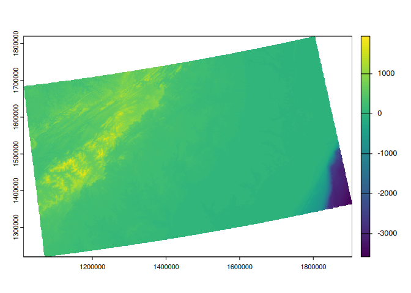

# chopin

<!-- badges: start -->

[](https://github.com/Spatiotemporal-Exposures-and-Toxicology/chopin/actions/workflows/test-coverage.yaml)
[](https://codecov.io/github/Spatiotemporal-Exposures-and-Toxicology/chopin)
[](https://github.com/Spatiotemporal-Exposures-and-Toxicology/chopin/actions/workflows/check-standard.yaml)
[](https://lifecycle.r-lib.org/articles/stages.html#experimental)

<!-- badges: end -->

## Objective and target users

### Objective

-   This package automates
    [parallelization](https://en.wikipedia.org/wiki/Parallel_computing)
    in spatial operations with `chopin` functions as well as
    [sf](https://github.com/r-spatial/sf)/[terra](https://github.com/rspatial/terra)
    functions. With [GDAL](https://gdal.org)-compatible files and
    database tables, `chopin` functions help to calculate spatial
    variables from vector and raster data with no external software
    requirements.

### For whom `chopin` is useful

-   Following user groups will find this package useful to accelerate
    the covariate calculation process for further analysis and modeling:
    -   Environmental health researchers and data analysts
    -   Health geographers and spatial epidemiologists
    -   Spatial analysts who need to perform geospatial operations with
        large datasets
-   We assume that users–
    -   Can run R functions following relevant instructions;
    -   Have basic knowledge of [geographic information system data
        models](https://r.geocompx.org/spatial-class), [coordinate
        systems and
        transformations](https://gistbok.ucgis.org/bok-topics/coordinate-transformations),
        [spatial operations](https://r.geocompx.org/spatial-operations),
        and [raster-vector
        overlay](https://r.geocompx.org/raster-vector);
    -   Understood and planned **what they want to calculate**; and
    -   Collected **datasets they need**

### Notes on data restrictions

-   This package works best with **two-dimensional** (**planar**)
    geometries. Users should disable `s2` spherical geometry mode in
    `sf` by setting. Running any `chopin` functions at spherical or
    three-dimensional (e.g., including M/Z dimensions) geometries may
    produce incorrect or unexpected results.

``` r
sf::sf_use_s2(FALSE)
```

## Basic design

-   Processing functions accept
    [sf](https://github.com/r-spatial/sf)/[terra](https://github.com/rspatial/terra)’s
    classes for spatial data. Raster-vector overlay is done with
    `exactextractr`.
-   From version 0.3.0, this package supports three basic functions that
    are readily parallelized over multithread environments:
    -   `extract_at`: extract raster values with point buffers or
        polygons.
        -   `extract_at_buffer`: extract raster values at circular
            buffers; kernel weight can be applied
        -   `extract_at_poly`
    -   `summarize_sedc`: calculate sums of [exponentially decaying
        contributions](https://mserre.sph.unc.edu/BMElab_web/SEDCtutorial/index.html)
    -   `summarize_aw`: area-weighted covariates based on target and
        reference polygons
-   When processing points/polygons in parallel, the entire study area
    will be divided into partly overlapped grids or processed through
    its own hierarchy. We suggest two flowcharts to help which function
    to use for parallel processing below. The upper flowchart is
    raster-oriented and the lower one is vector-oriented. They are
    separated but supplementary to each other. When a user follows the
    raster-oriented one, they might visit the vector-oriented flowchart
    at each end of the raster-oriented flowchart.
    -   `par_grid`: parallelize over artificial grid polygons that are
        generated from the maximum extent of inputs. `par_make_gridset`
        is used to generate the grid polygons before running this
        function.
    -   `par_hierarchy`: parallelize over hierarchy coded in identifier
        fields (for example, census blocks in each county in the US)
    -   `par_multirasters`: parallelize over multiple raster files
-   These functions are designed to be used with `future` and `doFuture`
    packages to parallelize over multiple CPU threads. Users can choose
    the number of threads to be used in the parallelization process.
    Users always need to register parallel workers with `future` and
    `doFuture` before running the three functions above.

``` r
doFuture::registerDoFuture()
future::plan(future::multicore, workers = 4L)
# future::multisession, future::cluster are available,
# See future.batchtools and future.callr for other options
# the number of workers are up to users' choice
```


## To run the examples

-   RStudio: download and open this document then press “Run All Chunks
    Above”, “Run All Chunks Below”, or “Restart R and Run All Chunks”,
    whichever is appropriate.
-   Visual Studio Code (with R extension): download and open this
    document then press “Run Above” at the last code chunk.
-   If you prefer command line (i.e., in Unix-like operating systems),
    run:

``` shell
git clone https://github.com/Spatiotemporal-Exposures-and-Toxicology/chopin
cd chopin
Rscript -e \
"
knitr::purl(\"README.Rmd\", \"README_run.r\")
source(\"README_run.r\")
"
```

## Installation

-   `chopin` can be installed using `remotes::install_github` (also
    possible with `pak::pak` or `devtools::install_github`).

``` r
# install.packages("remotes")
remotes::install_github("Spatiotemporal-Exposures-and-Toxicology/chopin")
```

## Examples

-   Examples will navigate `par_grid`, `par_hierarchy`, and
    `par_multirasters` functions in `chopin` to parallelize geospatial
    operations.

``` r
# check and install packages to run examples
pkgs <- c("chopin", "dplyr", "sf", "terra",
          "future", "future.apply", "doFuture", "testthat")
# install packages if anything is unavailable
rlang::check_installed(pkgs)

# disable spherical geometries
# it does the same as sf::sf_use_s2(FALSE)
options(sf_use_s2 = FALSE)
# parallelization-safe random number generator
set.seed(2024, kind = "L'Ecuyer-CMRG")
```

### `par_grid`: parallelize over artificial grid polygons

-   Please refer to a small example below for extracting mean altitude
    values at circular point buffers and census tracts in North
    Carolina.
-   Before running code chunks below, set the cloned `chopin` repository
    as your working directory with `setwd()`

``` r
ncpoly <- system.file("shape/nc.shp", package = "sf")
ncsf <- sf::read_sf(ncpoly)
ncsf <- sf::st_transform(ncsf, "EPSG:5070")
plot(sf::st_geometry(ncsf))
```


<!-- -->

#### Generate random points in NC

-   Ten thousands random point locations were generated inside the
    counties of North Carolina.

``` r
ncpoints <- sf::st_sample(ncsf, 1e4)
ncpoints <- sf::st_as_sf(ncpoints)
ncpoints$pid <- sprintf("PID-%05d", seq(1, 1e4))
plot(sf::st_geometry(ncpoints))
```


#### Target raster dataset: [Shuttle Radar Topography Mission](https://www.usgs.gov/centers/eros/science/usgs-eros-archive-digital-elevation-shuttle-radar-topography-mission-srtm-1)

-   We use an elevation dataset with and a moderate spatial resolution
    (approximately 400 meters or 0.25 miles).

``` r
# data preparation
wdir <- system.file("extdata", package = "chopin")
path_srtm <- file.path(wdir, "nc_srtm15_otm.rds")

# terra SpatRaster objects are wrapped when exported to rds file
srtm <- terra::unwrap(readRDS(path_srtm))
terra::crs(srtm) <- "EPSG:5070"
srtm
#> class       : SpatRaster 
#> dimensions  : 1534, 2281, 1  (nrow, ncol, nlyr)
#> resolution  : 391.5026, 391.5026  (x, y)
#> extent      : 1012872, 1905890, 1219961, 1820526  (xmin, xmax, ymin, ymax)
#> coord. ref. : NAD83 / Conus Albers (EPSG:5070) 
#> source(s)   : memory
#> name        : file928c3830468b 
#> min value   :        -3589.291 
#> max value   :         1946.400
terra::plot(srtm)
```



<!-- -->

``` r
ncpoints_tr <- terra::vect(ncpoints)
system.time(
  ncpoints_srtm <-
    chopin::extract_at(
      vector = ncpoints_tr,
      raster = srtm,
      id = "pid",
      mode = "buffer",
      radius = 1e4L  # 10,000 meters (10 km)
    )
)
#>    user  system elapsed 
#>  12.103   0.325  12.484
```

#### Generate regular grid computational regions

-   `chopin::par_make_gridset` takes a spatial dataset to generate
    regular grid polygons with `nx` and `ny` arguments with padding.
    Users will have both overlapping (by the degree of `radius`) and
    non-overlapping grids, both of which will be utilized to split
    locations and target datasets into sub-datasets for efficient
    processing.

``` r
compregions <-
  chopin::par_make_gridset(
    ncpoints_tr,
    mode = "grid",
    nx = 8L,
    ny = 5L,
    padding = 1e4L
  )
```

-   `compregions` is a list object with two elements named `original`
    (non-overlapping grid polygons) and `padded` (overlapping by
    `padding`). The figures below illustrate the grid polygons with and
    without overlaps.

``` r
names(compregions)
#> [1] "original" "padded"

oldpar <- par()
par(mfrow = c(2, 1))
terra::plot(compregions$original, main = "Original grids")
terra::plot(compregions$padded, main = "Padded grids")
```


<!-- -->

#### Parallel processing

-   Using the grid polygons, we distribute the task of averaging
    elevations at 10,000 circular buffer polygons, which are generated
    from the random locations, with 10 kilometers radius by
    `chopin::par_grid`.
-   Users always need to **register** multiple CPU threads (logical
    cores) for parallelization.
-   `chopin::par_*` functions are flexible in terms of supporting
    generic spatial operations in `sf` and `terra`, especially where two
    datasets are involved.
    -   Users can inject generic functions’ arguments (parameters) by
        writing them in the ellipsis (`...`) arguments, as demonstrated
        below:

``` r
future::plan(future::multicore, workers = 4L)
doFuture::registerDoFuture()

system.time(
  ncpoints_srtm_mthr <-
    chopin::par_grid(
      grids = compregions,
      grid_target_id = NULL,
      fun_dist = chopin::extract_at,
      vector = ncpoints_tr,
      raster = srtm,
      id = "pid",
      mode = "buffer",
      radius = 1e4L
    )
)
#> Your input function was successfully run at CGRIDID: 1
#> Your input function was successfully run at CGRIDID: 2
#> Your input function was successfully run at CGRIDID: 3
#> Your input function was successfully run at CGRIDID: 4
#> Your input function was successfully run at CGRIDID: 5
#> Your input function was successfully run at CGRIDID: 6
#> Your input function was successfully run at CGRIDID: 7
#> Your input function was successfully run at CGRIDID: 8
#> Your input function was successfully run at CGRIDID: 9
#> Your input function was successfully run at CGRIDID: 10
#> Your input function was successfully run at CGRIDID: 11
#> Your input function was successfully run at CGRIDID: 12
#> Your input function was successfully run at CGRIDID: 13
#> Your input function was successfully run at CGRIDID: 14
#> Your input function was successfully run at CGRIDID: 15
#> Your input function was successfully run at CGRIDID: 16
#> Your input function was successfully run at CGRIDID: 17
#> Your input function was successfully run at CGRIDID: 18
#> Your input function was successfully run at CGRIDID: 19
#> Your input function was successfully run at CGRIDID: 20
#> Your input function was successfully run at CGRIDID: 21
#> Your input function was successfully run at CGRIDID: 22
#> Your input function was successfully run at CGRIDID: 23
#> Your input function was successfully run at CGRIDID: 24
#> Your input function was successfully run at CGRIDID: 25
#> Your input function was successfully run at CGRIDID: 26
#> Your input function was successfully run at CGRIDID: 27
#> Your input function was successfully run at CGRIDID: 28
#> Your input function was successfully run at CGRIDID: 29
#> Your input function was successfully run at CGRIDID: 30
#> Your input function was successfully run at CGRIDID: 31
#> Your input function was successfully run at CGRIDID: 32
#> Your input function was successfully run at CGRIDID: 33
#>    user  system elapsed 
#>  11.093   1.993   4.072
```

``` r
colnames(ncpoints_srtm_mthr)[2] <- "mean_par"
ncpoints_compar <- merge(ncpoints_srtm, ncpoints_srtm_mthr)
# Are the calculations equal?
all.equal(ncpoints_compar$mean, ncpoints_compar$mean_par)
#> [1] TRUE
```

``` r
ncpoints_s <-
    merge(ncpoints, ncpoints_srtm)
ncpoints_m <-
    merge(ncpoints, ncpoints_srtm_mthr)

plot(ncpoints_s[, "mean"], main = "Single-thread", pch = 19, cex = 0.33)
```


``` r
plot(ncpoints_m[, "mean_par"], main = "Multi-thread", pch = 19, cex = 0.33)
```


<!-- -->
<!-- -->

### `chopin::par_hierarchy`: parallelize geospatial computations using intrinsic data hierarchy

-   In real world datasets, we usually have nested/exhaustive
    hierarchies. For example, land is organized by
    administrative/jurisdictional borders where multiple levels exist.
    In the U.S. context, a state consists of several counties, counties
    are split into census tracts, and they have a group of block groups.
-   `chopin::par_hierarchy` leverages such hierarchies to parallelize
    geospatial operations, which means that a group of lower-level
    geographic units in a higher-level geography is assigned to a
    process.
-   A demonstration below shows that census tracts are grouped by their
    counties then each county will be processed in a CPU thread.

#### Read data

``` r
path_nchrchy <- file.path(wdir, "nc_hierarchy.gpkg")

nc_data <- path_nchrchy
nc_county <- sf::st_read(nc_data, layer = "county")
#> Reading layer `county' from data source 
#>   `/tmp/RtmpK6lLFi/temp_libpath13aa5e6aa8e9de/chopin/extdata/nc_hierarchy.gpkg' 
#>   using driver `GPKG'
#> Simple feature collection with 100 features and 1 field
#> Geometry type: POLYGON
#> Dimension:     XY
#> Bounding box:  xmin: 1054155 ymin: 1341756 xmax: 1838923 ymax: 1690176
#> Projected CRS: NAD83 / Conus Albers
nc_tracts <- sf::st_read(nc_data, layer = "tracts")
#> Reading layer `tracts' from data source 
#>   `/tmp/RtmpK6lLFi/temp_libpath13aa5e6aa8e9de/chopin/extdata/nc_hierarchy.gpkg' 
#>   using driver `GPKG'
#> Simple feature collection with 2672 features and 1 field
#> Geometry type: MULTIPOLYGON
#> Dimension:     XY
#> Bounding box:  xmin: 1054155 ymin: 1341756 xmax: 1838923 ymax: 1690176
#> Projected CRS: NAD83 / Conus Albers

# reproject to Conus Albers Equal Area
nc_county <- sf::st_transform(nc_county, "EPSG:5070")
nc_tracts <- sf::st_transform(nc_tracts, "EPSG:5070")
nc_tracts$COUNTY <- substr(nc_tracts$GEOID, 1, 5)
```

#### Extract average SRTM elevations by single and multiple threads

``` r
# single-thread
system.time(
  nc_elev_tr_single <-
    chopin::extract_at(
      vector = nc_tracts,
      raster = srtm,
      id = "GEOID",
      mode = "polygon"
    )
)
#>    user  system elapsed 
#>   2.113   0.026   2.149

# hierarchical parallelization
system.time(
  nc_elev_tr_distr <-
    chopin::par_hierarchy(
      regions = nc_county, # higher level geometry
      split_level = "GEOID", # higher level unique id
      fun_dist = chopin::extract_at,
      vector = nc_tracts, # lower level geometry
      raster = srtm,
      id = "GEOID", # lower level unique id
      func = "mean"
    )
)
#>    user  system elapsed 
#>   0.051   0.023   3.079
```

### `par_multirasters`: parallelize over multiple rasters

-   There is a common case of having a large group of raster files at
    which the same operation should be performed.
-   `chopin::par_multirasters` is for such cases. An example below
    demonstrates where we have five elevation raster files to calculate
    the average elevation at counties in North Carolina.

``` r
nccnty <- terra::vect(nc_data, layer = "county")
ncelev <- terra::unwrap(readRDS(path_srtm))
terra::crs(ncelev) <- "EPSG:5070"
names(ncelev) <- c("srtm15")
tdir <- tempdir()

terra::writeRaster(ncelev, file.path(tdir, "test1.tif"), overwrite = TRUE)
terra::writeRaster(ncelev, file.path(tdir, "test2.tif"), overwrite = TRUE)
terra::writeRaster(ncelev, file.path(tdir, "test3.tif"), overwrite = TRUE)
terra::writeRaster(ncelev, file.path(tdir, "test4.tif"), overwrite = TRUE)
terra::writeRaster(ncelev, file.path(tdir, "test5.tif"), overwrite = TRUE)

# check if the raster files were exported as expected
testfiles <- list.files(tdir, pattern = "*.tif$", full.names = TRUE)
testfiles
#> [1] "/tmp/RtmpBc09zn/test1.tif" "/tmp/RtmpBc09zn/test2.tif"
#> [3] "/tmp/RtmpBc09zn/test3.tif" "/tmp/RtmpBc09zn/test4.tif"
#> [5] "/tmp/RtmpBc09zn/test5.tif"
```

``` r
system.time(
  res <-
    chopin::par_multirasters(
      filenames = testfiles,
      fun_dist = chopin::extract_at_poly,
      polys = nccnty,
      surf = ncelev,
      id = "GEOID",
      func = "mean"
    )
)
#>    user  system elapsed 
#>   1.835   0.652   1.170
knitr::kable(head(res))
```

| GEOID |      mean | base_raster               |
|:------|----------:|:--------------------------|
| 37037 | 136.80203 | /tmp/RtmpBc09zn/test1.tif |
| 37001 | 189.76170 | /tmp/RtmpBc09zn/test1.tif |
| 37057 | 231.16968 | /tmp/RtmpBc09zn/test1.tif |
| 37069 |  98.03845 | /tmp/RtmpBc09zn/test1.tif |
| 37155 |  41.23463 | /tmp/RtmpBc09zn/test1.tif |
| 37109 | 270.96933 | /tmp/RtmpBc09zn/test1.tif |

``` r
# remove temporary raster files
file.remove(testfiles)
#> [1] TRUE TRUE TRUE TRUE TRUE
```

<!--| GEOID |      mean |
|:------|----------:|
| 37037 | 136.80203 |
| 37001 | 189.76170 |
| 37057 | 231.16968 |
| 37069 |  98.03845 |
| 37155 |  41.23463 |
| 37109 | 270.96933 |
-->

## Parallelization of a generic geospatial operation

-   Other than `chopin` internal macros, `chopin::par_*` functions
    support generic geospatial operations.
-   An example below uses `terra::nearest`, which gets the nearest
    feature’s attributes, inside `chopin::par_grid`.

``` r
path_ncrd1 <- file.path(wdir, "ncroads_first.gpkg")

# Generate 5000 random points
pnts <- sf::st_sample(ncsf, 5000)
pnts <- sf::st_as_sf(pnts)
# assign identifiers
pnts$pid <- sprintf("RPID-%04d", seq(1, 5000))
pnts <- terra::vect(pnts)
rd1 <- terra::vect(path_ncrd1)

# reproject
pnts <- terra::project(pnts, "EPSG:5070")
rd1 <- terra::project(rd1, "EPSG:5070")

# generate grids
nccompreg <-
  chopin::par_make_gridset(
    input = pnts,
    mode = "grid",
    nx = 4L,
    ny = 2L,
    padding = 5e4L
  )
```

-   The figure below shows the padded grids (50 kilometers), primary
    roads, and points. Primary roads will be selected by a padded grid
    per iteration and used to calculate the distance from each point to
    the nearest primary road. Padded grids and their overlapping areas
    will look different according to `padding` argument in
    `chopin::par_make_gridset`.

``` r
# plot
terra::plot(nccompreg$padded, border = "orange")
terra::plot(terra::vect(ncsf), add = TRUE)
terra::plot(rd1, col = "blue", add = TRUE)
terra::plot(pnts, add = TRUE, cex = 0.3)
legend(1.02e6, 1.72e6,
       legend = c("Computation grids (50km padding)", "Major roads"),
       lty = 1, lwd = 1, col = c("orange", "blue"),
       cex = 0.5)
```


``` r
# terra::nearest run
system.time(
  restr <- terra::nearest(x = pnts, y = rd1)
)
#>    user  system elapsed 
#>   0.978   0.001   0.982

# we use four threads that were configured above
system.time(
  res <-
    chopin::par_grid(
      grids = nccompreg,
      fun_dist = terra::nearest,
      x = pnts,
      y = rd1
    )
)
#> Your input function was successfully run at CGRIDID: 1
#> Your input function was successfully run at CGRIDID: 2
#> Your input function was successfully run at CGRIDID: 3
#> Your input function was successfully run at CGRIDID: 4
#> Your input function was successfully run at CGRIDID: 5
#> Your input function was successfully run at CGRIDID: 6
#> Your input function was successfully run at CGRIDID: 7
#> Your input function was successfully run at CGRIDID: 8
#>    user  system elapsed 
#>   1.140   0.619   0.625
```

-   We will compare the results from the single-thread and multi-thread
    calculation.

``` r
resj <- merge(restr, res, by = c("from_x", "from_y"))
all.equal(resj$distance.x, resj$distance.y)
#> [1] TRUE
```

-   Users should be mindful of potential caveats in the parallelization
    of nearest feature search, which may result in no or excess distance
    depending on the distribution of the target dataset to which the
    nearest feature is searched.
    -   For example, when one wants to calculate the nearest interstate
        from rural homes with fine grids, some grids may have no
        interstates then homes in such grids will not get any distance
        to the nearest interstate.
    -   Such problems can be avoided by choosing `nx`, `ny`, and
        `padding` values in `par_make_gridset` meticulously.

## Why parallelization is slower than the ordinary function run?

-   Parallelization may underperform when the datasets are too small to
    take advantage of divide-and-compute approach, where parallelization
    overhead is involved. Overhead here refers to the required amount of
    computational resources for transferring objects to multiple
    processes.
-   Since the demonstrations above use quite small datasets, the
    advantage of parallelization was not as noticeable as it was
    expected. Should a large amount of data (spatial/temporal resolution
    or number of files, for example) be processed, users could see the
    efficiency of this package. Please refer to a
    [vignette](https://kyle-messier.github.io/chopin/articles/v02_climate_examples.html)
    in this package for the demonstration of various climate/weather
    datasets.

#### Last edited: March 15, 2024
