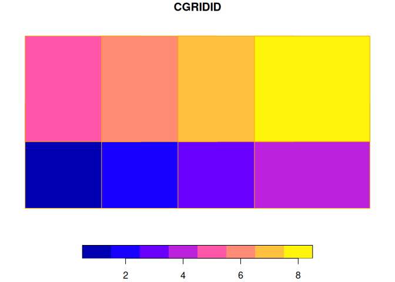

# `chopin`: Computation for Climate and Health research On Parallelized INfrastructure

<!-- badges: start -->

[](https://github.com/NIEHS/chopin/actions)
[](https://github.com/NIEHS/chopin/actions/workflows/check-standard.yaml)
[](https://github.com/ropensci/software-review/issues/638)
[](https://lifecycle.r-lib.org/articles/stages.html#experimental)

<!-- badges: end -->

## Objective and target users

### Objective

-   This package automates
    [parallelization](https://en.wikipedia.org/wiki/Parallel_computing)
    in spatial operations with `chopin` functions as well as
    [sf](https://github.com/r-spatial/sf)/[terra](https://github.com/rspatial/terra)
    functions. With [GDAL](https://gdal.org)-compatible files and
    database tables, `chopin` functions help to calculate spatial
    variables from vector and raster data with no external software
    requirements.

### For whom `chopin` is useful

-   All who need to perform geospatial operations with large datasets
    may find this package useful to accelerate the covariate calculation
    process for further analysis and modeling.
-   We assume that users–
    -   Have basic knowledge of [geographic information system data
        models](https://r.geocompx.org/spatial-class), [coordinate
        systems and
        transformations](https://gistbok.ucgis.org/bok-topics/coordinate-transformations),
        [spatial operations](https://r.geocompx.org/spatial-operations),
        and [raster-vector
        overlay](https://r.geocompx.org/raster-vector);
    -   Understood and planned **what they want to calculate**; and
    -   Collected **datasets they need**

## Overview

-   Processing functions accept
    [terra](https://github.com/rspatial/terra)/[sf](https://github.com/r-spatial/sf)
    classes for spatial data. Raster-vector overlay is done with
    `exactextractr`.
-   From version 0.8.0, this package supports three basic functions that
    are readily parallelized over multithread environments:
    -   `extract_at`: extract raster values with point buffers or
        polygons with or without kernel weights
    -   `summarize_sedc`: calculate sums of [exponentially decaying
        contributions](https://mserre.sph.unc.edu/BMElab_web/SEDCtutorial/index.html)
    -   `summarize_aw`: area-weighted covariates based on target and
        reference polygons
-   When processing points/polygons in parallel, the entire study area
    will be divided into partly overlapped grids or processed through
    its own hierarchy. We suggest two flowcharts to help which function
    to use for parallel processing below. The upper flowchart is
    raster-oriented and the lower one is vector-oriented. They are
    separated but supplementary to each other. When a user follows the
    raster-oriented one, they might visit the vector-oriented flowchart
    at each end of the raster-oriented flowchart.
    -   `par_grid`: parallelize over artificial grid polygons that are
        generated from the maximum extent of inputs. `par_pad_grid` is
        used to generate the grid polygons before running this function.
    -   `par_hierarchy`: parallelize over hierarchy coded in identifier
        fields (for example, census blocks in each county in the US)
    -   `par_multirasters`: parallelize over multiple raster files
-   These functions are designed to be used with `future` and `doFuture`
    packages to parallelize over multiple CPU threads. Users can choose
    the number of threads to be used in the parallelization process.
    Users always need to register parallel workers with `future` and
    `doFuture` before running the three functions above.

``` r
future::plan(future::multicore, workers = 4L)
# future::multisession, future::cluster are available,
# See future.batchtools and future.callr for other options
# the number of workers are up to users' choice
```


## Installation

-   `chopin` can be installed using `remotes::install_github` (also
    possible with `pak::pak` or `devtools::install_github`).

``` r
rlang::check_installed("remotes")
remotes::install_github("NIEHS/chopin")
```

## Examples

-   Examples will navigate `par_grid`, `par_hierarchy`, and
    `par_multirasters` functions in `chopin` to parallelize geospatial
    operations.

``` r
# check and install packages to run examples
pkgs <- c("chopin", "dplyr", "sf", "terra", "future", "future.mirai", "mirai")
# install packages if anything is unavailable
rlang::check_installed(pkgs)

library(chopin)
library(dplyr)
#> 
#> Attaching package: 'dplyr'
#> The following objects are masked from 'package:stats':
#> 
#>     filter, lag
#> The following objects are masked from 'package:base':
#> 
#>     intersect, setdiff, setequal, union
```

``` r
library(sf)
#> Linking to GEOS 3.12.1, GDAL 3.8.5, PROJ 9.4.0; sf_use_s2() is TRUE
```

``` r
library(terra)
#> terra 1.7.78
```

``` r
library(future)
library(future.mirai)
library(mirai)

# disable spherical geometries
sf::sf_use_s2(FALSE)
#> Spherical geometry (s2) switched off
```

``` r
# parallelization-safe random number generator
set.seed(2024, kind = "L'Ecuyer-CMRG")
```

### `par_grid`: parallelize over artificial grid polygons

-   Please refer to a small example below for extracting mean altitude
    values at circular point buffers and census tracts in North
    Carolina.
-   Before running code chunks below, set the cloned `chopin` repository
    as your working directory with `setwd()`

``` r
ncpoly <- system.file("shape/nc.shp", package = "sf")
ncsf <- sf::read_sf(ncpoly)
ncsf <- sf::st_transform(ncsf, "EPSG:5070")
plot(sf::st_geometry(ncsf))
```


#### Generate random points in NC

-   Ten thousands random point locations were generated inside the
    counties of North Carolina.

``` r
ncpoints <- sf::st_sample(ncsf, 1e4)
ncpoints <- sf::st_as_sf(ncpoints)
ncpoints$pid <- sprintf("PID-%05d", seq(1, 1e4))
plot(sf::st_geometry(ncpoints))
```


#### Target raster dataset: [Shuttle Radar Topography Mission](https://www.usgs.gov/centers/eros/science/usgs-eros-archive-digital-elevation-shuttle-radar-topography-mission-srtm-1)

-   We use an elevation dataset with and a moderate spatial resolution
    (approximately 400 meters or 0.25 miles).

``` r
# data preparation
wdir <- system.file("extdata", package = "chopin")
srtm <- file.path(wdir, "nc_srtm15_otm.tif")

# terra SpatRaster objects are wrapped when exported to rds file
srtm_ras <- terra::rast(srtm)
terra::crs(srtm_ras) <- "EPSG:5070"
srtm_ras
#> class       : SpatRaster 
#> dimensions  : 1534, 2281, 1  (nrow, ncol, nlyr)
#> resolution  : 391.5026, 391.5026  (x, y)
#> extent      : 1012872, 1905890, 1219961, 1820526  (xmin, xmax, ymin, ymax)
#> coord. ref. : NAD83 / Conus Albers (EPSG:5070) 
#> source      : nc_srtm15_otm.tif 
#> name        :    srtm15 
#> min value   : -3589.291 
#> max value   :  1946.400
```

``` r
terra::plot(srtm_ras)
```


``` r
# ncpoints_tr <- terra::vect(ncpoints)
system.time(
  ncpoints_srtm <-
    chopin::extract_at(
      x = srtm,
      y = ncpoints,
      id = "pid",
      mode = "buffer",
      radius = 1e4L  # 10,000 meters (10 km)
    )
)
#> Input is a character. Attempt to read it with terra::rast...
#>    user  system elapsed 
#>   7.188   0.194   7.445
```

#### Generate regular grid computational regions

-   `chopin::par_pad_grid` takes a spatial dataset to generate regular
    grid polygons with `nx` and `ny` arguments with padding. Users will
    have both overlapping (by the degree of `radius`) and
    non-overlapping grids, both of which will be utilized to split
    locations and target datasets into sub-datasets for efficient
    processing.

``` r
compregions <-
  chopin::par_pad_grid(
    ncpoints,
    mode = "grid",
    nx = 2L,
    ny = 2L,
    padding = 1e4L
  )
#> Switch sf class to terra...
#> Switch terra class to sf...
```

-   `compregions` is a list object with two elements named `original`
    (non-overlapping grid polygons) and `padded` (overlapping by
    `padding`). The figures below illustrate the grid polygons with and
    without overlaps.

``` r
names(compregions)
#> [1] "original" "padded"
```

``` r
oldpar <- par()
par(mfrow = c(2, 1))
terra::plot(compregions$original, main = "Original grids")
```


``` r
terra::plot(compregions$padded, main = "Padded grids")
```


#### Parallel processing

-   Using the grid polygons, we distribute the task of averaging
    elevations at 10,000 circular buffer polygons, which are generated
    from the random locations, with 10 kilometers radius by
    `chopin::par_grid`.
-   Users always need to **register** multiple CPU threads (logical
    cores) for parallelization.
-   `chopin::par_*` functions are flexible in terms of supporting
    generic spatial operations in `sf` and `terra`, especially where two
    datasets are involved.
    -   Users can inject generic functions’ arguments (parameters) by
        writing them in the ellipsis (`...`) arguments, as demonstrated
        below:

``` r
future::plan(future.mirai::mirai_multisession, workers = 4L)

system.time(
  ncpoints_srtm_mthr <-
    par_grid(
      grids = compregions,
      grid_target_id = NULL,
      fun_dist = extract_at,
      x = srtm,
      y = ncpoints,
      id = "pid",
      radius = 1e4L
    )
)
#> ℹ Input is not a character.
#> class       : SpatRaster 
#> dimensions  : 482, 1045, 1  (nrow, ncol, nlyr)
#> resolution  : 391.5026, 391.5026  (x, y)
#> window      : 1044193, 1453313, 1339761, 1528465  (xmin, xmax, ymin, ymax)
#> coord. ref. : NAD83 / Conus Albers (EPSG:5070) 
#> source      : nc_srtm15_otm.tif 
#> name        :     srtm15 
#> min value   : >-3589.291 
#> max value   :  1946.400< 
#> Simple feature collection with 2438 features and 1 field
#> Geometry type: POINT
#> Dimension:     XY
#> Bounding box:  xmin: 1054330 ymin: 1391103 xmax: 1442879 ymax: 1517953
#> Projected CRS: NAD83 / Conus Albers
#> First 10 features:
#>                          x       pid
#> 5  POINT (1410529 1458819) PID-00005
#> 9  POINT (1131921 1455291) PID-00009
#> 10 POINT (1434619 1467609) PID-00010
#> 11 POINT (1270905 1499816) PID-00011
#> 23 POINT (1244995 1508710) PID-00023
#> 25 POINT (1405078 1439867) PID-00025
#> 29 POINT (1408674 1457802) PID-00029
#> 37 POINT (1411973 1502543) PID-00037
#> 38 POINT (1412068 1508631) PID-00038
#> 40 POINT (1260986 1458922) PID-00040
#> Input is a character. Attempt to read it with terra::rast...
#> ℹ Task at CGRIDID: 1 is successfully dispatched.
#> class       : SpatRaster 
#> dimensions  : 482, 1045, 1  (nrow, ncol, nlyr)
#> resolution  : 391.5026, 391.5026  (x, y)
#> window      : 1432955, 1842075, 1339761, 1528465  (xmin, xmax, ymin, ymax)
#> coord. ref. : NAD83 / Conus Albers (EPSG:5070) 
#> source      : nc_srtm15_otm.tif 
#> name        :     srtm15 
#> min value   : >-3589.291 
#> max value   :  1946.400< 
#> Simple feature collection with 2635 features and 1 field
#> Geometry type: POINT
#> Dimension:     XY
#> Bounding box:  xmin: 1443299 ymin: 1350035 xmax: 1767274 ymax: 1518199
#> Projected CRS: NAD83 / Conus Albers
#> First 10 features:
#>                          x       pid
#> 3  POINT (1624371 1429836) PID-00003
#> 6  POINT (1523223 1494088) PID-00006
#> 12 POINT (1600270 1471267) PID-00012
#> 13 POINT (1477121 1493743) PID-00013
#> 14 POINT (1751298 1493682) PID-00014
#> 15 POINT (1531538 1476444) PID-00015
#> 17 POINT (1524580 1461271) PID-00017
#> 22 POINT (1601098 1367800) PID-00022
#> 24 POINT (1466226 1509786) PID-00024
#> 31 POINT (1491108 1430338) PID-00031
#> Input is a character. Attempt to read it with terra::rast...
#> ℹ Task at CGRIDID: 2 is successfully dispatched.
#> class       : SpatRaster 
#> dimensions  : 482, 1045, 1  (nrow, ncol, nlyr)
#> resolution  : 391.5026, 391.5026  (x, y)
#> window      : 1044193, 1453313, 1508107, 1696812  (xmin, xmax, ymin, ymax)
#> coord. ref. : NAD83 / Conus Albers (EPSG:5070) 
#> source      : nc_srtm15_otm.tif 
#> name        :     srtm15 
#> min value   : >-3589.291 
#> max value   :  1946.400< 
#> Simple feature collection with 1472 features and 1 field
#> Geometry type: POINT
#> Dimension:     XY
#> Bounding box:  xmin: 1179599 ymin: 1518277 xmax: 1443112 ymax: 1622578
#> Projected CRS: NAD83 / Conus Albers
#> First 10 features:
#>                          x       pid
#> 1  POINT (1435579 1518707) PID-00001
#> 2  POINT (1331083 1576085) PID-00002
#> 4  POINT (1371677 1528418) PID-00004
#> 8  POINT (1374645 1582600) PID-00008
#> 16 POINT (1264019 1538038) PID-00016
#> 18 POINT (1343801 1572309) PID-00018
#> 19 POINT (1438158 1578160) PID-00019
#> 20 POINT (1376587 1576726) PID-00020
#> 26 POINT (1307098 1579682) PID-00026
#> 27 POINT (1354805 1583302) PID-00027
#> Input is a character. Attempt to read it with terra::rast...
#> ℹ Task at CGRIDID: 3 is successfully dispatched.
#> class       : SpatRaster 
#> dimensions  : 482, 1045, 1  (nrow, ncol, nlyr)
#> resolution  : 391.5026, 391.5026  (x, y)
#> window      : 1432955, 1842075, 1508107, 1696812  (xmin, xmax, ymin, ymax)
#> coord. ref. : NAD83 / Conus Albers (EPSG:5070) 
#> source      : nc_srtm15_otm.tif 
#> name        :     srtm15 
#> min value   : >-3589.291 
#> max value   :  1946.400< 
#> Simple feature collection with 3455 features and 1 field
#> Geometry type: POINT
#> Dimension:     XY
#> Bounding box:  xmin: 1443367 ymin: 1518309 xmax: 1831979 ymax: 1686439
#> Projected CRS: NAD83 / Conus Albers
#> First 10 features:
#>                          x       pid
#> 7  POINT (1443684 1606262) PID-00007
#> 21 POINT (1588258 1638188) PID-00021
#> 28 POINT (1595359 1589051) PID-00028
#> 32 POINT (1567533 1593222) PID-00032
#> 33 POINT (1613271 1646682) PID-00033
#> 39 POINT (1443664 1589476) PID-00039
#> 50 POINT (1735709 1664568) PID-00050
#> 51 POINT (1575131 1535233) PID-00051
#> 53 POINT (1451075 1558588) PID-00053
#> 55 POINT (1624736 1531919) PID-00055
#> Input is a character. Attempt to read it with terra::rast...
#> ℹ Task at CGRIDID: 4 is successfully dispatched.
#>    user  system elapsed 
#>   0.358   0.009   8.264
```

``` r
colnames(ncpoints_srtm_mthr)[2] <- "mean_par"
ncpoints_compar <- merge(ncpoints_srtm, ncpoints_srtm_mthr)
# Are the calculations equal?
all.equal(ncpoints_compar$mean, ncpoints_compar$mean_par)
#> [1] TRUE
```

``` r
ncpoints_s <-
  merge(ncpoints, ncpoints_srtm)
ncpoints_m <-
  merge(ncpoints, ncpoints_srtm_mthr)

plot(ncpoints_s[, "mean"], main = "Single-thread", pch = 19, cex = 0.33)
```


``` r
plot(ncpoints_m[, "mean_par"], main = "Multi-thread", pch = 19, cex = 0.33)
```


### `chopin::par_hierarchy`: parallelize geospatial computations using intrinsic data hierarchy

-   In real world datasets, we usually have nested/exhaustive
    hierarchies. For example, land is organized by
    administrative/jurisdictional borders where multiple levels exist.
    In the U.S. context, a state consists of several counties, counties
    are split into census tracts, and they have a group of block groups.
-   `chopin::par_hierarchy` leverages such hierarchies to parallelize
    geospatial operations, which means that a group of lower-level
    geographic units in a higher-level geography is assigned to a
    process.
-   A demonstration below shows that census tracts are grouped by their
    counties then each county will be processed in a CPU thread.

#### Read data

``` r
path_nchrchy <- file.path(wdir, "nc_hierarchy.gpkg")

nc_data <- path_nchrchy
nc_county <- sf::st_read(nc_data, layer = "county")
#> Reading layer `county' from data source 
#>   `/tmp/RtmpKwucBZ/temp_libpath20abd224698c2/chopin/extdata/nc_hierarchy.gpkg' 
#>   using driver `GPKG'
#> Simple feature collection with 100 features and 1 field
#> Geometry type: POLYGON
#> Dimension:     XY
#> Bounding box:  xmin: 1054155 ymin: 1341756 xmax: 1838923 ymax: 1690176
#> Projected CRS: NAD83 / Conus Albers
```

``` r
nc_tracts <- sf::st_read(nc_data, layer = "tracts")
#> Reading layer `tracts' from data source 
#>   `/tmp/RtmpKwucBZ/temp_libpath20abd224698c2/chopin/extdata/nc_hierarchy.gpkg' 
#>   using driver `GPKG'
#> Simple feature collection with 2672 features and 1 field
#> Geometry type: MULTIPOLYGON
#> Dimension:     XY
#> Bounding box:  xmin: 1054155 ymin: 1341756 xmax: 1838923 ymax: 1690176
#> Projected CRS: NAD83 / Conus Albers
```

``` r
# reproject to Conus Albers Equal Area
nc_county <- sf::st_transform(nc_county, "EPSG:5070")
nc_tracts <- sf::st_transform(nc_tracts, "EPSG:5070")
nc_tracts$COUNTY <- substr(nc_tracts$GEOID, 1, 5)
```

#### Extract average SRTM elevations by single and multiple threads

``` r
# single-thread
system.time(
  nc_elev_tr_single <-
    chopin::extract_at(
      x = srtm,
      y = nc_tracts,
      id = "GEOID",
      mode = "polygon"
    )
)
#> Input is a character. Attempt to read it with terra::rast...
#>    user  system elapsed 
#>   1.022   0.023   1.048
```

``` r
# hierarchical parallelization
system.time(
  nc_elev_tr_distr <-
    chopin::par_hierarchy(
      regions = nc_county, # higher level geometry
      regions_id = "GEOID", # higher level unique id
      fun_dist = chopin::extract_at,
      x = srtm,
      y = nc_tracts, # lower level geometry
      id = "GEOID", # lower level unique id
      func = "mean"
    )
)
#> ℹ Input is not a character.
#> Input is a character. Attempt to read it with terra::rast...ℹ Your input function at 37037 is dispatched.
#> Input is a character. Attempt to read it with terra::rast...ℹ Your input function at 37001 is dispatched.
#> Input is a character. Attempt to read it with terra::rast...ℹ Your input function at 37057 is dispatched.
#> Input is a character. Attempt to read it with terra::rast...ℹ Your input function at 37069 is dispatched.
#> Input is a character. Attempt to read it with terra::rast...ℹ Your input function at 37155 is dispatched.
#> Input is a character. Attempt to read it with terra::rast...ℹ Your input function at 37109 is dispatched.
#> Input is a character. Attempt to read it with terra::rast...ℹ Your input function at 37027 is dispatched.
#> Input is a character. Attempt to read it with terra::rast...ℹ Your input function at 37063 is dispatched.
#> Input is a character. Attempt to read it with terra::rast...ℹ Your input function at 37145 is dispatched.
#> Input is a character. Attempt to read it with terra::rast...ℹ Your input function at 37115 is dispatched.
#> Input is a character. Attempt to read it with terra::rast...ℹ Your input function at 37151 is dispatched.
#> Input is a character. Attempt to read it with terra::rast...ℹ Your input function at 37131 is dispatched.
#> Input is a character. Attempt to read it with terra::rast...ℹ Your input function at 37013 is dispatched.
#> Input is a character. Attempt to read it with terra::rast...ℹ Your input function at 37159 is dispatched.
#> Input is a character. Attempt to read it with terra::rast...ℹ Your input function at 37051 is dispatched.
#> Input is a character. Attempt to read it with terra::rast...ℹ Your input function at 37153 is dispatched.
#> Input is a character. Attempt to read it with terra::rast...ℹ Your input function at 37093 is dispatched.
#> Input is a character. Attempt to read it with terra::rast...ℹ Your input function at 37025 is dispatched.
#> Input is a character. Attempt to read it with terra::rast...ℹ Your input function at 37029 is dispatched.
#> Input is a character. Attempt to read it with terra::rast...ℹ Your input function at 37169 is dispatched.
#> Input is a character. Attempt to read it with terra::rast...ℹ Your input function at 37031 is dispatched.
#> Input is a character. Attempt to read it with terra::rast...ℹ Your input function at 37005 is dispatched.
#> Input is a character. Attempt to read it with terra::rast...ℹ Your input function at 37139 is dispatched.
#> Input is a character. Attempt to read it with terra::rast...ℹ Your input function at 37193 is dispatched.
#> Input is a character. Attempt to read it with terra::rast...ℹ Your input function at 37003 is dispatched.
#> Input is a character. Attempt to read it with terra::rast...ℹ Your input function at 37083 is dispatched.
#> Input is a character. Attempt to read it with terra::rast...ℹ Your input function at 37163 is dispatched.
#> Input is a character. Attempt to read it with terra::rast...ℹ Your input function at 37189 is dispatched.
#> Input is a character. Attempt to read it with terra::rast...ℹ Your input function at 37173 is dispatched.
#> Input is a character. Attempt to read it with terra::rast...ℹ Your input function at 37011 is dispatched.
#> Input is a character. Attempt to read it with terra::rast...ℹ Your input function at 37045 is dispatched.
#> Input is a character. Attempt to read it with terra::rast...ℹ Your input function at 37125 is dispatched.
#> Input is a character. Attempt to read it with terra::rast...ℹ Your input function at 37067 is dispatched.
#> Input is a character. Attempt to read it with terra::rast...ℹ Your input function at 37077 is dispatched.
#> Input is a character. Attempt to read it with terra::rast...ℹ Your input function at 37185 is dispatched.
#> Input is a character. Attempt to read it with terra::rast...ℹ Your input function at 37137 is dispatched.
#> Input is a character. Attempt to read it with terra::rast...ℹ Your input function at 37033 is dispatched.
#> Input is a character. Attempt to read it with terra::rast...ℹ Your input function at 37107 is dispatched.
#> Input is a character. Attempt to read it with terra::rast...ℹ Your input function at 37075 is dispatched.
#> Input is a character. Attempt to read it with terra::rast...ℹ Your input function at 37073 is dispatched.
#> Input is a character. Attempt to read it with terra::rast...ℹ Your input function at 37161 is dispatched.
#> Input is a character. Attempt to read it with terra::rast...ℹ Your input function at 37187 is dispatched.
#> Input is a character. Attempt to read it with terra::rast...ℹ Your input function at 37007 is dispatched.
#> Input is a character. Attempt to read it with terra::rast...ℹ Your input function at 37135 is dispatched.
#> Input is a character. Attempt to read it with terra::rast...ℹ Your input function at 37049 is dispatched.
#> Input is a character. Attempt to read it with terra::rast...ℹ Your input function at 37195 is dispatched.
#> Input is a character. Attempt to read it with terra::rast...ℹ Your input function at 37061 is dispatched.
#> Input is a character. Attempt to read it with terra::rast...ℹ Your input function at 37087 is dispatched.
#> Input is a character. Attempt to read it with terra::rast...ℹ Your input function at 37081 is dispatched.
#> Input is a character. Attempt to read it with terra::rast...ℹ Your input function at 37099 is dispatched.
#> Input is a character. Attempt to read it with terra::rast...ℹ Your input function at 37097 is dispatched.
#> Input is a character. Attempt to read it with terra::rast...ℹ Your input function at 37091 is dispatched.
#> Input is a character. Attempt to read it with terra::rast...ℹ Your input function at 37149 is dispatched.
#> Input is a character. Attempt to read it with terra::rast...ℹ Your input function at 37165 is dispatched.
#> Input is a character. Attempt to read it with terra::rast...ℹ Your input function at 37085 is dispatched.
#> Input is a character. Attempt to read it with terra::rast...ℹ Your input function at 37105 is dispatched.
#> Input is a character. Attempt to read it with terra::rast...ℹ Your input function at 37017 is dispatched.
#> Input is a character. Attempt to read it with terra::rast...ℹ Your input function at 37039 is dispatched.
#> Input is a character. Attempt to read it with terra::rast...ℹ Your input function at 37035 is dispatched.
#> Input is a character. Attempt to read it with terra::rast...ℹ Your input function at 37177 is dispatched.
#> Input is a character. Attempt to read it with terra::rast...ℹ Your input function at 37113 is dispatched.
#> Input is a character. Attempt to read it with terra::rast...ℹ Your input function at 37143 is dispatched.
#> Input is a character. Attempt to read it with terra::rast...ℹ Your input function at 37095 is dispatched.
#> Input is a character. Attempt to read it with terra::rast...ℹ Your input function at 37071 is dispatched.
#> Input is a character. Attempt to read it with terra::rast...ℹ Your input function at 37101 is dispatched.
#> Input is a character. Attempt to read it with terra::rast...ℹ Your input function at 37015 is dispatched.
#> Input is a character. Attempt to read it with terra::rast...ℹ Your input function at 37167 is dispatched.
#> Input is a character. Attempt to read it with terra::rast...ℹ Your input function at 37079 is dispatched.
#> Input is a character. Attempt to read it with terra::rast...ℹ Your input function at 37129 is dispatched.
#> Input is a character. Attempt to read it with terra::rast...ℹ Your input function at 37147 is dispatched.
#> Input is a character. Attempt to read it with terra::rast...ℹ Your input function at 37141 is dispatched.
#> Input is a character. Attempt to read it with terra::rast...ℹ Your input function at 37179 is dispatched.
#> Input is a character. Attempt to read it with terra::rast...ℹ Your input function at 37121 is dispatched.
#> Input is a character. Attempt to read it with terra::rast...ℹ Your input function at 37133 is dispatched.
#> Input is a character. Attempt to read it with terra::rast...ℹ Your input function at 37065 is dispatched.
#> Input is a character. Attempt to read it with terra::rast...ℹ Your input function at 37119 is dispatched.
#> Input is a character. Attempt to read it with terra::rast...ℹ Your input function at 37199 is dispatched.
#> Input is a character. Attempt to read it with terra::rast...ℹ Your input function at 37197 is dispatched.
#> Input is a character. Attempt to read it with terra::rast...ℹ Your input function at 37023 is dispatched.
#> Input is a character. Attempt to read it with terra::rast...ℹ Your input function at 37191 is dispatched.
#> Input is a character. Attempt to read it with terra::rast...ℹ Your input function at 37059 is dispatched.
#> Input is a character. Attempt to read it with terra::rast...ℹ Your input function at 37111 is dispatched.
#> Input is a character. Attempt to read it with terra::rast...ℹ Your input function at 37183 is dispatched.
#> Input is a character. Attempt to read it with terra::rast...ℹ Your input function at 37053 is dispatched.
#> Input is a character. Attempt to read it with terra::rast...ℹ Your input function at 37103 is dispatched.
#> Input is a character. Attempt to read it with terra::rast...ℹ Your input function at 37041 is dispatched.
#> Input is a character. Attempt to read it with terra::rast...ℹ Your input function at 37021 is dispatched.
#> Input is a character. Attempt to read it with terra::rast...ℹ Your input function at 37157 is dispatched.
#> Input is a character. Attempt to read it with terra::rast...ℹ Your input function at 37117 is dispatched.
#> Input is a character. Attempt to read it with terra::rast...ℹ Your input function at 37089 is dispatched.
#> Input is a character. Attempt to read it with terra::rast...ℹ Your input function at 37127 is dispatched.
#> Input is a character. Attempt to read it with terra::rast...ℹ Your input function at 37009 is dispatched.
#> Input is a character. Attempt to read it with terra::rast...ℹ Your input function at 37019 is dispatched.
#> Input is a character. Attempt to read it with terra::rast...ℹ Your input function at 37123 is dispatched.
#> Input is a character. Attempt to read it with terra::rast...ℹ Your input function at 37181 is dispatched.
#> Input is a character. Attempt to read it with terra::rast...ℹ Your input function at 37175 is dispatched.
#> Input is a character. Attempt to read it with terra::rast...ℹ Your input function at 37171 is dispatched.
#> Input is a character. Attempt to read it with terra::rast...ℹ Your input function at 37043 is dispatched.
#> Input is a character. Attempt to read it with terra::rast...ℹ Your input function at 37055 is dispatched.
#> Input is a character. Attempt to read it with terra::rast...ℹ Your input function at 37047 is dispatched.
#>    user  system elapsed 
#>   0.197   0.083   1.948
```

### `par_multirasters`: parallelize over multiple rasters

-   There is a common case of having a large group of raster files at
    which the same operation should be performed.
-   `chopin::par_multirasters` is for such cases. An example below
    demonstrates where we have five elevation raster files to calculate
    the average elevation at counties in North Carolina.

``` r
# nccnty <- sf::st_read(nc_data, layer = "county")
ncelev <- terra::rast(srtm)
terra::crs(ncelev) <- "EPSG:5070"
names(ncelev) <- c("srtm15")
tdir <- tempdir()

terra::writeRaster(ncelev, file.path(tdir, "test1.tif"), overwrite = TRUE)
terra::writeRaster(ncelev, file.path(tdir, "test2.tif"), overwrite = TRUE)
terra::writeRaster(ncelev, file.path(tdir, "test3.tif"), overwrite = TRUE)
terra::writeRaster(ncelev, file.path(tdir, "test4.tif"), overwrite = TRUE)
terra::writeRaster(ncelev, file.path(tdir, "test5.tif"), overwrite = TRUE)

# check if the raster files were exported as expected
testfiles <- list.files(tdir, pattern = "*.tif$", full.names = TRUE)
testfiles
#> [1] "/tmp/Rtmps5rak7/test1.tif" "/tmp/Rtmps5rak7/test2.tif"
#> [3] "/tmp/Rtmps5rak7/test3.tif" "/tmp/Rtmps5rak7/test4.tif"
#> [5] "/tmp/Rtmps5rak7/test5.tif"
```

``` r
system.time(
  res <-
    chopin::par_multirasters(
      filenames = testfiles,
      fun_dist = chopin::extract_at,
      x = ncelev,
      y = nc_county,
      id = "GEOID",
      func = "mean"
    )
)
#> Input is a character. Attempt to read it with terra::rast...
#> ℹ Your input function at /tmp/Rtmps5rak7/test1.tif is dispatched.
#> 
#> Input is a character. Attempt to read it with terra::rast...
#> ℹ Your input function at /tmp/Rtmps5rak7/test2.tif is dispatched.
#> 
#> Input is a character. Attempt to read it with terra::rast...
#> ℹ Your input function at /tmp/Rtmps5rak7/test3.tif is dispatched.
#> 
#> Input is a character. Attempt to read it with terra::rast...
#> ℹ Your input function at /tmp/Rtmps5rak7/test4.tif is dispatched.
#> 
#> Input is a character. Attempt to read it with terra::rast...
#> ℹ Your input function at /tmp/Rtmps5rak7/test5.tif is dispatched.
#>    user  system elapsed 
#>   1.089   0.128   2.129
```

``` r
knitr::kable(head(res))
```

| GEOID |      mean | base_raster               |
|:------|----------:|:--------------------------|
| 37037 | 136.80203 | /tmp/Rtmps5rak7/test1.tif |
| 37001 | 189.76170 | /tmp/Rtmps5rak7/test1.tif |
| 37057 | 231.16968 | /tmp/Rtmps5rak7/test1.tif |
| 37069 |  98.03845 | /tmp/Rtmps5rak7/test1.tif |
| 37155 |  41.23463 | /tmp/Rtmps5rak7/test1.tif |
| 37109 | 270.96933 | /tmp/Rtmps5rak7/test1.tif |

``` r
# remove temporary raster files
file.remove(testfiles)
#> [1] TRUE TRUE TRUE TRUE TRUE
```

<!--| GEOID |      mean |
|:------|----------:|
| 37037 | 136.80203 |
| 37001 | 189.76170 |
| 37057 | 231.16968 |
| 37069 |  98.03845 |
| 37155 |  41.23463 |
| 37109 | 270.96933 |
-->

## Parallelization of a generic geospatial operation

-   Other than `chopin` internal macros, `chopin::par_*` functions
    support generic geospatial operations.
-   An example below uses `terra::nearest`, which gets the nearest
    feature’s attributes, inside `chopin::par_grid`.

``` r
path_ncrd1 <- file.path(wdir, "ncroads_first.gpkg")

# Generate 5000 random points
pnts <- sf::st_sample(nc_county, 5000)
pnts <- sf::st_as_sf(pnts)
# assign identifiers
pnts$pid <- sprintf("RPID-%04d", seq(1, 5000))
rd1 <- sf::st_read(path_ncrd1)
#> Reading layer `ncroads_first' from data source 
#>   `/tmp/RtmpKwucBZ/temp_libpath20abd224698c2/chopin/extdata/ncroads_first.gpkg' 
#>   using driver `GPKG'
#> Simple feature collection with 620 features and 4 fields
#> Geometry type: MULTILINESTRING
#> Dimension:     XY
#> Bounding box:  xmin: 1152512 ymin: 1390719 xmax: 1748367 ymax: 1662294
#> Projected CRS: NAD83 / Conus Albers
```

``` r
# reproject
pntst <- sf::st_transform(pnts, "EPSG:5070")
rd1t <- sf::st_transform(rd1, "EPSG:5070")

# generate grids
nccompreg <-
  chopin::par_pad_grid(
    input = pntst,
    mode = "grid",
    nx = 4L,
    ny = 2L,
    padding = 5e4L
  )
#> Switch sf class to terra...
#> Switch terra class to sf...
```

-   The figure below shows the padded grids (50 kilometers), primary
    roads, and points. Primary roads will be selected by a padded grid
    per iteration and used to calculate the distance from each point to
    the nearest primary road. Padded grids and their overlapping areas
    will look different according to `padding` argument in
    `chopin::par_pad_grid`.

``` r
# plot
terra::plot(nccompreg$padded, border = "orange")
terra::plot(terra::vect(ncsf), add = TRUE)
terra::plot(rd1t, col = "blue", add = TRUE)
#> Warning in plot.sf(rd1t, col = "blue", add = TRUE): ignoring all but the first
#> attribute
```

``` r
terra::plot(pntst, add = TRUE, cex = 0.3)
legend(1.02e6, 1.72e6,
       legend = c("Computation grids (50km padding)", "Major roads"),
       lty = 1, lwd = 1, col = c("orange", "blue"),
       cex = 0.5)
```



``` r
# terra::nearest run
system.time(
  restr <- terra::nearest(x = terra::vect(pntst), y = terra::vect(rd1t))
)
#>    user  system elapsed 
#>   0.604   0.005   0.610
```

``` r
pnt_path <- file.path(tdir, "pntst.gpkg")
sf::st_write(pntst, pnt_path)
#> Writing layer `pntst' to data source `/tmp/Rtmps5rak7/pntst.gpkg' using driver `GPKG'
#> Writing 5000 features with 1 fields and geometry type Point.
```

``` r
# we use four threads that were configured above
system.time(
  resd <-
    chopin::par_grid(
      grids = nccompreg,
      fun_dist = terra::nearest,
      x = pnt_path,
      y = path_ncrd1,
      pad_y = TRUE
    )
)
#>  class       : SpatVector 
#>  geometry    : points 
#>  dimensions  : 488, 1  (geometries, attributes)
#>  extent      : 1054478, 1249004, 1390663, 1515471  (xmin, xmax, ymin, ymax)
#>  source      : pntst.gpkg
#>  coord. ref. : NAD83 / Conus Albers (EPSG:5070) 
#>  names       :       pid
#>  type        :     <chr>
#>  values      : RPID-1444
#>                RPID-1841
#>                RPID-0853
#>  class       : SpatVector 
#>  geometry    : lines 
#>  dimensions  : 84, 4  (geometries, attributes)
#>  extent      : 1152512, 1303251, 1433305, 1518486  (xmin, xmax, ymin, ymax)
#>  source      : ncroads_first.gpkg
#>  coord. ref. : NAD83 / Conus Albers (EPSG:5070) 
#>  names       :      LINEARID                  FULLNAME RTTYP MTFCC
#>  type        :         <chr>                     <chr> <chr> <chr>
#>  values      : 1104258839602                     I- 40     I S1100
#>                1108296491445 Great Smoky Mountain Expy     M S1100
#>                1108296491281                 US Hwy 74     U S1100
#>  class       : SpatVector 
#>  geometry    : points 
#>  dimensions  : 555, 1  (geometries, attributes)
#>  extent      : 1250716, 1445965, 1419548, 1515518  (xmin, xmax, ymin, ymax)
#>  source      : pntst.gpkg
#>  coord. ref. : NAD83 / Conus Albers (EPSG:5070) 
#>  names       :       pid
#>  type        :     <chr>
#>  values      : RPID-0936
#>                RPID-1208
#>                RPID-1608
#>  class       : SpatVector 
#>  geometry    : lines 
#>  dimensions  : 295, 4  (geometries, attributes)
#>  extent      : 1185649, 1504814, 1429541, 1587945  (xmin, xmax, ymin, ymax)
#>  source      : ncroads_first.gpkg
#>  coord. ref. : NAD83 / Conus Albers (EPSG:5070) 
#>  names       :      LINEARID FULLNAME RTTYP MTFCC
#>  type        :         <chr>    <chr> <chr> <chr>
#>  values      : 1106049845762    I- 40     I S1100
#>                1104259294640    I- 40     I S1100
#>                1105589484633    I- 26     I S1100
#> Input is a character. Trying to read with terra .
#> Input is a character. Trying to read with terra .
#> ℹ Task at CGRIDID: 1 is successfully dispatched.
#> 
#> Input is a character. Trying to read with terra .
#> Input is a character. Trying to read with terra .
#> ℹ Task at CGRIDID: 2 is successfully dispatched.
#>  class       : SpatVector 
#>  geometry    : points 
#>  dimensions  : 901, 1  (geometries, attributes)
#>  extent      : 1446138, 1641470, 1344877, 1515528  (xmin, xmax, ymin, ymax)
#>  source      : pntst.gpkg
#>  coord. ref. : NAD83 / Conus Albers (EPSG:5070) 
#>  names       :       pid
#>  type        :     <chr>
#>  values      : RPID-1468
#>                RPID-1839
#>                RPID-1454
#>  class       : SpatVector 
#>  geometry    : lines 
#>  dimensions  : 310, 4  (geometries, attributes)
#>  extent      : 1376030, 1702259, 1390719, 1587945  (xmin, xmax, ymin, ymax)
#>  source      : ncroads_first.gpkg
#>  coord. ref. : NAD83 / Conus Albers (EPSG:5070) 
#>  names       :       LINEARID  FULLNAME RTTYP MTFCC
#>  type        :          <chr>     <chr> <chr> <chr>
#>  values      : 11013869865467 US Hwy 74     U S1100
#>                 1104258210883     I- 74     I S1100
#>                 1108475827871    I- 295     I S1100
#>  class       : SpatVector 
#>  geometry    : points 
#>  dimensions  : 407, 1  (geometries, attributes)
#>  extent      : 1641968, 1788924, 1348913, 1515521  (xmin, xmax, ymin, ymax)
#>  source      : pntst.gpkg
#>  coord. ref. : NAD83 / Conus Albers (EPSG:5070) 
#>  names       :       pid
#>  type        :     <chr>
#>  values      : RPID-1220
#>                RPID-2907
#>                RPID-0881
#>  class       : SpatVector 
#>  geometry    : lines 
#>  dimensions  : 85, 4  (geometries, attributes)
#>  extent      : 1563182, 1705286, 1390719, 1569623  (xmin, xmax, ymin, ymax)
#>  source      : ncroads_first.gpkg
#>  coord. ref. : NAD83 / Conus Albers (EPSG:5070) 
#>  names       :      LINEARID          FULLNAME RTTYP MTFCC
#>  type        :         <chr>             <chr> <chr> <chr>
#>  values      : 1104486471510             I- 95     I S1100
#>                1108475828261      State Hwy 44     S S1100
#>                1104259298129 State Hwy 581 Spr     S S1100
#> Input is a character. Trying to read with terra .
#> Input is a character. Trying to read with terra .
#> ℹ Task at CGRIDID: 3 is successfully dispatched.
#> 
#> Input is a character. Trying to read with terra .
#> Input is a character. Trying to read with terra .
#> ℹ Task at CGRIDID: 4 is successfully dispatched.
#>  class       : SpatVector 
#>  geometry    : points 
#>  dimensions  : 46, 1  (geometries, attributes)
#>  extent      : 1178798, 1248719, 1516354, 1544764  (xmin, xmax, ymin, ymax)
#>  source      : pntst.gpkg
#>  coord. ref. : NAD83 / Conus Albers (EPSG:5070) 
#>  names       :       pid
#>  type        :     <chr>
#>  values      : RPID-0700
#>                RPID-2266
#>                RPID-2287
#>  class       : SpatVector 
#>  geometry    : lines 
#>  dimensions  : 48, 4  (geometries, attributes)
#>  extent      : 1152512, 1303251, 1458814, 1518486  (xmin, xmax, ymin, ymax)
#>  source      : ncroads_first.gpkg
#>  coord. ref. : NAD83 / Conus Albers (EPSG:5070) 
#>  names       :      LINEARID  FULLNAME RTTYP MTFCC
#>  type        :         <chr>     <chr> <chr> <chr>
#>  values      : 1104258839602     I- 40     I S1100
#>                1108296491281 US Hwy 74     U S1100
#>                1108296490453 US Hwy 23     U S1100
#>  class       : SpatVector 
#>  geometry    : points 
#>  dimensions  : 647, 1  (geometries, attributes)
#>  extent      : 1250491, 1445465, 1515590, 1621468  (xmin, xmax, ymin, ymax)
#>  source      : pntst.gpkg
#>  coord. ref. : NAD83 / Conus Albers (EPSG:5070) 
#>  names       :       pid
#>  type        :     <chr>
#>  values      : RPID-4919
#>                RPID-0015
#>                RPID-1018
#>  class       : SpatVector 
#>  geometry    : lines 
#>  dimensions  : 256, 4  (geometries, attributes)
#>  extent      : 1185649, 1511560, 1442977, 1626595  (xmin, xmax, ymin, ymax)
#>  source      : ncroads_first.gpkg
#>  coord. ref. : NAD83 / Conus Albers (EPSG:5070) 
#>  names       :      LINEARID FULLNAME RTTYP MTFCC
#>  type        :         <chr>    <chr> <chr> <chr>
#>  values      : 1106049845762    I- 40     I S1100
#>                1104259294640    I- 40     I S1100
#>                1105589484633    I- 26     I S1100
#> Input is a character. Trying to read with terra .
#> Input is a character. Trying to read with terra .
#> ℹ Task at CGRIDID: 5 is successfully dispatched.
#> 
#> Input is a character. Trying to read with terra .
#> Input is a character. Trying to read with terra .
#> ℹ Task at CGRIDID: 6 is successfully dispatched.
#>  class       : SpatVector 
#>  geometry    : points 
#>  dimensions  : 907, 1  (geometries, attributes)
#>  extent      : 1446072, 1641283, 1515605, 1660026  (xmin, xmax, ymin, ymax)
#>  source      : pntst.gpkg
#>  coord. ref. : NAD83 / Conus Albers (EPSG:5070) 
#>  names       :       pid
#>  type        :     <chr>
#>  values      : RPID-0194
#>                RPID-1423
#>                RPID-1194
#>  class       : SpatVector 
#>  geometry    : lines 
#>  dimensions  : 351, 4  (geometries, attributes)
#>  extent      : 1376030, 1702259, 1450702, 1657708  (xmin, xmax, ymin, ymax)
#>  source      : ncroads_first.gpkg
#>  coord. ref. : NAD83 / Conus Albers (EPSG:5070) 
#>  names       :      LINEARID  FULLNAME RTTYP MTFCC
#>  type        :         <chr>     <chr> <chr> <chr>
#>  values      : 1108475827871    I- 295     I S1100
#>                  11020305945 US Hwy 13     U S1100
#>                  11020305943 US Hwy 13     U S1100
#>  class       : SpatVector 
#>  geometry    : points 
#>  dimensions  : 1049, 1  (geometries, attributes)
#>  extent      : 1641771, 1837499, 1515899, 1686227  (xmin, xmax, ymin, ymax)
#>  source      : pntst.gpkg
#>  coord. ref. : NAD83 / Conus Albers (EPSG:5070) 
#>  names       :       pid
#>  type        :     <chr>
#>  values      : RPID-0401
#>                RPID-0978
#>                RPID-1229
#>  class       : SpatVector 
#>  geometry    : lines 
#>  dimensions  : 88, 4  (geometries, attributes)
#>  extent      : 1563182, 1748367, 1450702, 1662294  (xmin, xmax, ymin, ymax)
#>  source      : ncroads_first.gpkg
#>  coord. ref. : NAD83 / Conus Albers (EPSG:5070) 
#>  names       :      LINEARID          FULLNAME RTTYP MTFCC
#>  type        :         <chr>             <chr> <chr> <chr>
#>  values      : 1104486471510             I- 95     I S1100
#>                1108475828261      State Hwy 44     S S1100
#>                1104259298129 State Hwy 581 Spr     S S1100
#> Input is a character. Trying to read with terra .
#> Input is a character. Trying to read with terra .
#> ℹ Task at CGRIDID: 7 is successfully dispatched.
#> 
#> Input is a character. Trying to read with terra .
#> Input is a character. Trying to read with terra .
#> ℹ Task at CGRIDID: 8 is successfully dispatched.
#>    user  system elapsed 
#>   0.086   0.005   0.778
```

-   We will compare the results from the single-thread and multi-thread
    calculation.

``` r
resj <- merge(restr, resd, by = c("from_x", "from_y"))
all.equal(resj$distance.x, resj$distance.y)
#> [1] TRUE
```

-   Users should be mindful of potential caveats in the parallelization
    of nearest feature search, which may result in no or excess distance
    depending on the distribution of the target dataset to which the
    nearest feature is searched.
    -   For example, when one wants to calculate the nearest interstate
        from rural homes with fine grids, some grids may have no
        interstates then homes in such grids will not get any distance
        to the nearest interstate.
    -   Such problems can be avoided by choosing `nx`, `ny`, and
        `padding` values in `par_pad_grid` meticulously.

### Notes on data restrictions

-   `chopin` works best with **two-dimensional** (**planar**)
    geometries. Users should disable `s2` spherical geometry mode in
    `sf` by setting. Running any `chopin` functions at spherical or
    three-dimensional (e.g., including M/Z dimensions) geometries may
    produce incorrect or unexpected results.

``` r
sf::sf_use_s2(FALSE)
```

## Why parallelization is slower than the ordinary function run?

-   Parallelization may underperform when the datasets are too small to
    take advantage of divide-and-compute approach, where parallelization
    overhead is involved. Overhead here refers to the required amount of
    computational resources for transferring objects to multiple
    processes.
-   Since the demonstrations above use quite small datasets, the
    advantage of parallelization was not as noticeable as it was
    expected. Should a large amount of data (spatial/temporal resolution
    or number of files, for example) be processed, users could see the
    efficiency of this package. Please refer to a
    [vignette](https://kyle-messier.github.io/chopin/articles/v02_climate_examples.html)
    in this package for the demonstration of various climate/weather
    datasets.
