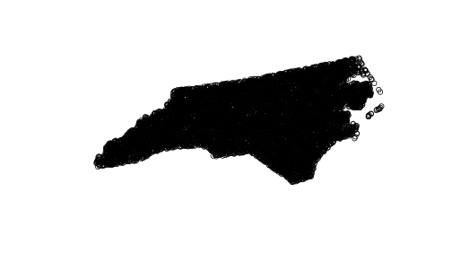
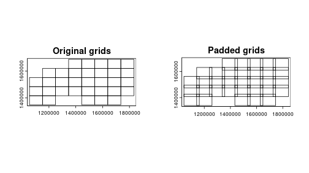
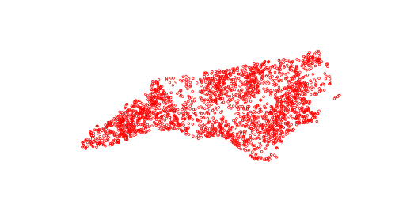

# Prepare input data

```r
library(chopin)
library(dplyr)
library(sf)
library(terra)
options(sf_use_s2 = FALSE)
```


```r
ncpoly <- system.file("shape/nc.shp", package = "sf")
ncsf <- sf::read_sf(ncpoly)
ncsf <- sf::st_transform(ncsf, "EPSG:5070")
plot(sf::st_geometry(ncsf))
```

<div class="figure">

<p class="caption">plot of chunk nc-load</p>
</div>


```r
ncpoints <- sf::st_sample(ncsf, 10000)
plot(sf::st_geometry(ncpoints))
```

<div class="figure">

<p class="caption">plot of chunk nc-random</p>
</div>

```r
# st_sample output is st_sfc. We should convert it to sf
ncpoints <- st_as_sf(ncpoints)
ncpoints$pid <- seq(1, nrow(ncpoints))
```

# Computational grids

## Visualize computational grids


```r
ncpoints_tr <- terra::vect(ncpoints)
compregions <-
  chopin::par_make_gridset(
    ncpoints_tr,
    mode = "grid",
    nx = 8L,
    ny = 5L,
    padding = 1e4L
  )

names(compregions)
```

```
## [1] "original" "padded"
```

```r
par(mfcol = c(1, 2))
plot(compregions$original, main = "Original grids")
plot(compregions$padded, main = "Padded grids")
```

<div class="figure">

<p class="caption">plot of chunk grid-plain</p>
</div>

## Other types of grids

```r
# returns 5 by 5 grids
compregions_q <-
  chopin::par_make_gridset(
    ncpoints_tr,
    mode = "grid_quantile",
    padding = 1e4L,
    quantiles = par_def_q(5L)
  )

par(mfcol = c(1, 2))
plot(compregions_q$original, main = "Original grids (quantiles)")
plot(compregions_q$padded, main = "Padded grids (quantiles)")
```

<div class="figure">

<p class="caption">plot of chunk grid-others</p>
</div>

## Clustered points
Clustered points will produce larger merged grids in the results with `mode = "grid_advanced"`.

```r
## advanced
data("ncpoints", package = "chopin")
ncpoints <- sf::st_as_sf(ncpoints, coords = 1:2, crs = "EPSG:5070")
plot(ncpoints$geometry, col = "red", cex = 0.5)
```

<div class="figure">

<p class="caption">plot of chunk grid-advanced</p>
</div>

```r
compregions_a <-
  chopin::par_make_gridset(
    ncpoints,
    mode = "grid_advanced",
    padding = 1e4L,
    nx = 15L, ny = 8L,
    grid_min_features = 20L
  )
par(mfcol = c(1, 2))
plot(compregions_a$original$geometry, main = "Original grids (advanced)")
plot(compregions_a$padded$geometry, main = "Padded grids (advanced)")
```

<div class="figure">

<p class="caption">plot of chunk grid-advanced</p>
</div>


## Notes
- Computational grids are the exhaustive split of the entire study region. You should take a square buffer of each grid to clip the target raster or vector.
