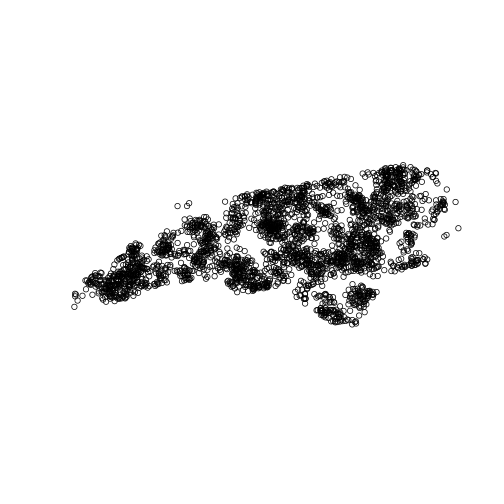
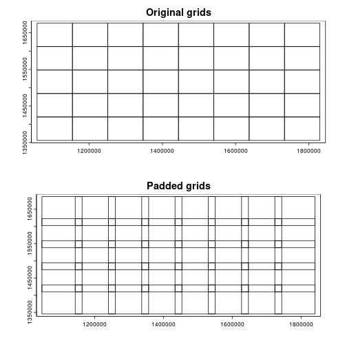
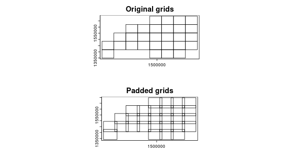
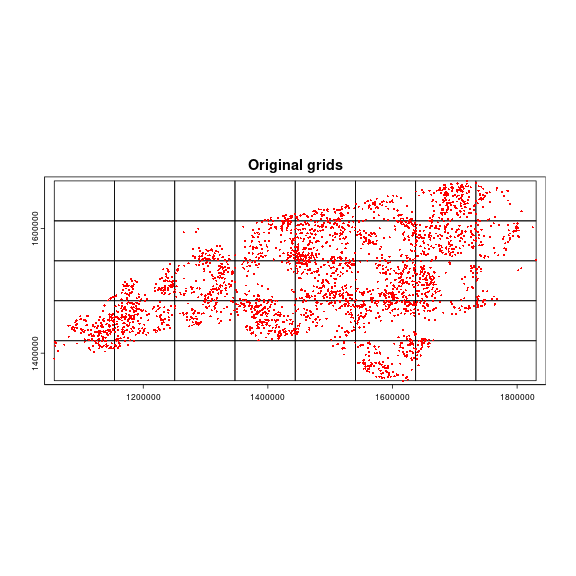
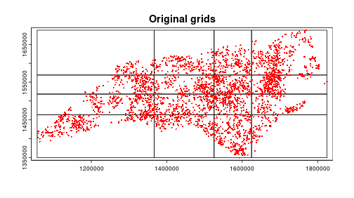
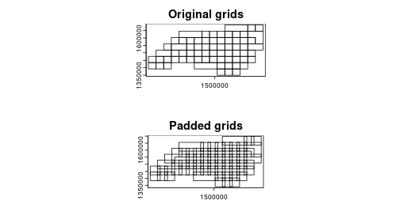
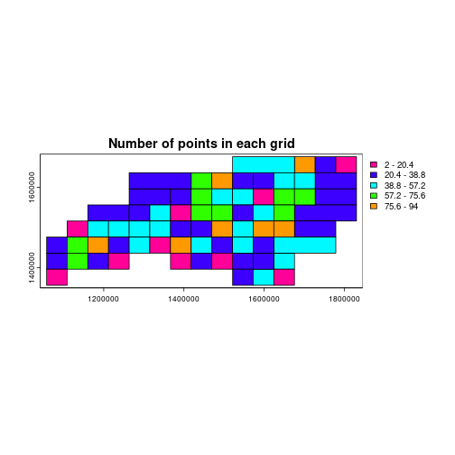
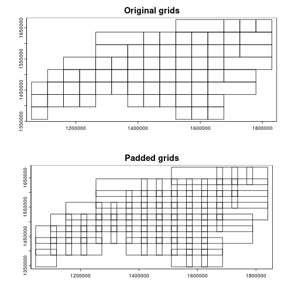
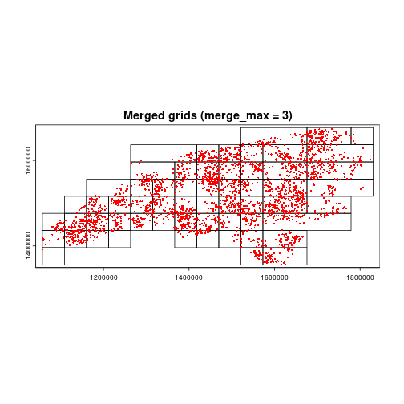

``` r
library(chopin)
library(dplyr)
library(sf)
library(terra)
library(anticlust)
library(igraph)
options(sf_use_s2 = FALSE)
```

## Computational grids
- Computational grids refer to a set of polygons that cover the entire spatial domain of interest. These grids are used to split the spatial domain into smaller pieces for parallel processing.
- `chopin` provides functions to generate computational grids for parallel processing by `par_grid()` function.
- The standard sequence of running `par_grid()` includes the following steps:
    1. Generate computational grids with `par_make_gridset()` or `par_group_grid()`. This step will give you a set of grid polygons, one of which is original splits and the other is padded in consideration of buffer radius in the subsequent spatial operations.
    2. Run `par_grid()` with the input dataset and the grid polygons.

## Types of computational grids and their generation

- There are two approaches to generate computational grids. One is to use `par_make_gridset()` with one of three `mode`s and the other is to use `par_group_grid()`. Thus, users have **four options** in total to generate computational grids.

### `par_make_gridset()`: standard interface
- `par_make_gridset()` generates regular grid polygons with padding for parallel processing. Padding is the distance of overlapping between grid polygons, essentially from the buffer radius of the points when buffer polygons are concerned.
- `par_make_gridset()` supports three internal `mode`s:
    - `mode = "grid"`: generates regular grid polygons with padding, `nx` and `ny` arguments determine the number of columns and rows in the grid, respectively.
    - `mode = "grid_quantile"`: generates regular grid polygons with padding based on quantiles of the number of points in each grid. The grids will look irregular and the points per grid will be more balanced than the `grid` mode.
    - `mode = "grid_advanced"`: generates regular grid polygons with padding based on the number of points in each grid and the number of points in the entire dataset. `nx` and `ny` arguments determine the number of columns and rows in the grid, then `merge_max` argument controls how many adjacent grids are merged into one grid. `grid_min_features` argument determines the minimum number of points in each grid, which means grids with fewer points than this value will be merged with adjacent grids. Adjusting these arguments can balance the computational load among the threads and reduce the overhead of parallelization.


### `par_group_grid()`: focusing on getting the balanced clusters
- Expanding the exhaustive grid generation, `par_group_grid()` generates rectangles that cover the same number of points per grid. Users can use the output of this function into `par_grid()` for parallel processing by converting it to the grid sets with `par_group_grid()`.


### Random points in NC
- For demonstration of `par_make_gridset()`, we use moderately clustered point locations generated inside the counties of North Carolina.

``` r
ncpoly <- system.file("shape/nc.shp", package = "sf")
ncsf <- sf::read_sf(ncpoly)
ncsf <- sf::st_transform(ncsf, "EPSG:5070")
plot(sf::st_geometry(ncsf))
```

<div class="figure">

<p class="caption">plot of chunk nc-gen-points</p>
</div>

``` r
set.seed(202404)
library(spatstat.random)
ncpoints <-
  sf::st_sample(
    x = ncsf,
    type = "Thomas",
    mu = 20,
    scale = 1e4,
    kappa = 1.25e-9
  )
ncpoints <- sf::st_as_sf(ncpoints)
ncpoints$pid <- sprintf("PID-%05d", seq(1, nrow(ncpoints)))
plot(sf::st_geometry(ncpoints))
```



``` r
# convert to terra SpatVector
ncpoints_tr <- chopin::dep_switch(ncpoints)
```

<!-- -->

## Visualize computational grids


``` r
ncpoints_tr <- terra::vect(ncpoints)
compregions <-
  chopin::par_make_gridset(
    ncpoints_tr,
    mode = "grid",
    nx = 8L,
    ny = 5L,
    padding = 1e4L
  )

# a list object
class(compregions)
```

```
## [1] "list"
```

``` r
# length of 2
names(compregions)
```

```
## [1] "original" "padded"
```

``` r
par(mfrow = c(2, 1))
plot(compregions$original, main = "Original grids")
plot(compregions$padded, main = "Padded grids")
```



### Generate regular grid computational regions
- `chopin::par_make_gridset()` takes a spatial dataset to generate regular grid polygons with `nx` and `ny` arguments with padding. Users will have both overlapping (by the degree of `radius`) and non-overlapping grids, both of which will be utilized to split locations and target datasets into sub-datasets for efficient processing.

``` r
compregions <-
  chopin::par_make_gridset(
    ncpoints_tr,
    mode = "grid",
    nx = 8L,
    ny = 5L,
    padding = 1e4L
  )
```

- The output of `par_make_gridset()` is a list object with two elements named `original` (non-overlapping grid polygons) and `padded` (overlapping by `padding`). The class of each element depends on the input dataset class. The figures below illustrate the grid polygons with and without overlaps.


``` r
names(compregions)
```

```
## [1] "original" "padded"
```

``` r
oldpar <- par()
par(mfrow = c(2, 1))
terra::plot(compregions$original, main = "Original grids")
terra::plot(compregions$padded, main = "Padded grids")
```



``` r
par(mfrow = c(1, 1))
terra::plot(compregions$original, main = "Original grids")
terra::plot(ncpoints_tr, add = TRUE, col = "red", cex = 0.4)
```




### Split the points by two 1D quantiles
- `mode = "grid_quantile"` generates regular grid polygons with padding based on quantiles of the coordinates in each dimension.
- When using this mode, users should define `quantiles` argument, which will be used to get the same number of quantiles in each dimension. A convenient way to define quantiles is to use `chopin::par_def_q()` function.


``` r
grid_quantiles <-
  chopin::par_make_gridset(
    input = ncpoints_tr,
    mode = "grid_quantile",
    quantiles = chopin::par_def_q(4L),
    padding = 1e4L
  )

names(grid_quantiles)
```

```
## [1] "original" "padded"
```

``` r
par(mfrow = c(2, 1))
terra::plot(grid_quantiles$original, main = "Original grids")
terra::plot(grid_quantiles$padded, main = "Padded grids")
```


``` r
par(mfrow = c(1, 1))
terra::plot(grid_quantiles$original, main = "Original grids")
terra::plot(ncpoints_tr, add = TRUE, col = "red", cex = 0.4)
```



### Merge the grids based on the number of points
- `mode = "grid_advanced"` utilizes finer grids to merge the results from the finer grids into the coarser grids. This behavior can balance the computational load among the threads and reduce the overhead of parallelization. That said, this mode internally generates grids in `mode = "grid"` and merges them based on the number of points in each grid.
- To determine the adjacency and merging behavior, minimum spanning tree is used. The function utilizes `igraph::mst()` and other graph summary functions under the hood. 
- As a note, you could adjust the merging behavior by changing the arguments `grid_min_features` and `merge_max`.


``` r
grid_advanced1 <-
  chopin::par_make_gridset(
    input = ncpoints_tr,
    mode = "grid_advanced",
    nx = 15L,
    ny = 8L,
    padding = 1e4L,
    grid_min_features = 25L,
    merge_max = 5L
  )

par(mfrow = c(2, 1))
terra::plot(grid_advanced1$original, main = "Original grids")
terra::plot(grid_advanced1$padded, main = "Padded grids")
```



``` r
par(mfrow = c(1, 1))
terra::plot(grid_advanced1$original, main = "Merged grids (merge_max = 5)")
terra::plot(ncpoints_tr, add = TRUE, col = "red", cex = 0.4)
```


``` r
ncpoints_tr$n <- 1
n_points <- terra::zonal(ncpoints_tr, grid_advanced1$original, fun = "sum")[["n"]]

grid_advanced1g <- grid_advanced1$original
grid_advanced1g$n_points <- n_points

terra::plot(grid_advanced1g, "n_points", main = "Number of points in each grid")
```



#### Different values in `merge_max`
- Keeping other arguments the same, we can see the difference in the number of merged grids by changing the `merge_max` argument.

``` r
grid_advanced2 <-
  chopin::par_make_gridset(
    input = ncpoints_tr,
    mode = "grid_advanced",
    nx = 15L,
    ny = 8L,
    padding = 1e4L,
    grid_min_features = 25L,
    merge_max = 8L
  )

par(mfrow = c(2, 1))
terra::plot(grid_advanced2$original, main = "Original grids")
terra::plot(grid_advanced2$padded, main = "Padded grids")
```


``` r
par(mfrow = c(1, 1))
terra::plot(grid_advanced2$original, main = "Merged grids (merge_max = 8)")
terra::plot(ncpoints_tr, add = TRUE, col = "red", cex = 0.4)
```


``` r
grid_advanced3 <-
  chopin::par_make_gridset(
    input = ncpoints_tr,
    mode = "grid_advanced",
    nx = 15L,
    ny = 8L,
    padding = 1e4L,
    grid_min_features = 25L,
    merge_max = 3L
  )

par(mfrow = c(2, 1))
terra::plot(grid_advanced3$original, main = "Original grids")
terra::plot(grid_advanced3$padded, main = "Padded grids")
```



``` r
par(mfrow = c(1, 1))
terra::plot(grid_advanced3$original, main = "Merged grids (merge_max = 3)")
terra::plot(ncpoints_tr, add = TRUE, col = "red", cex = 0.4)
```




#### `par_group_grid()`
- `par_group_grid()` uses `anticlust` package to split the point set into the balanced clusters.
    - In the background, `par_group_balanced()` is run first to generate the equally sized clusters from the input. Then, padding is applied to the extent of each cluster to be compatible with `par_grid()`, where both the original and the padded grids are used.
    - Please note that `ngroups` argument value must be the **exact** divisor of the number of points. For example, in the example below, when one changes `ngroups` to `10L`, it will fail as the number of points is not divisible by 10.
    - Consult the `anticlust` package for more details on the algorithm.
- `par_group_grid()` makes a compatible object to the output of `par_make_gridset()` directly from the input points.
- As illustrated in the figure below, the points will be split into `ngroups` clusters with the same number of points then processed in parallel by using the output object with `par_grid()`.


``` r
group_bal_grid <-
  chopin::par_group_grid(
    points_in = ncpoints_tr,
    ngroups = 23L,
    padding = 1e4
  )
group_bal_grid$original$CGRIDID <- as.factor(group_bal_grid$original$CGRIDID)

par(mfrow = c(2, 1))
terra::plot(group_bal_grid$original, "CGRIDID",
            legend = FALSE,
            main = "Assigned points (ngroups = 23)")
terra::plot(group_bal_grid$padded, main = "Padded grids")
```


